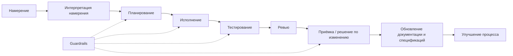
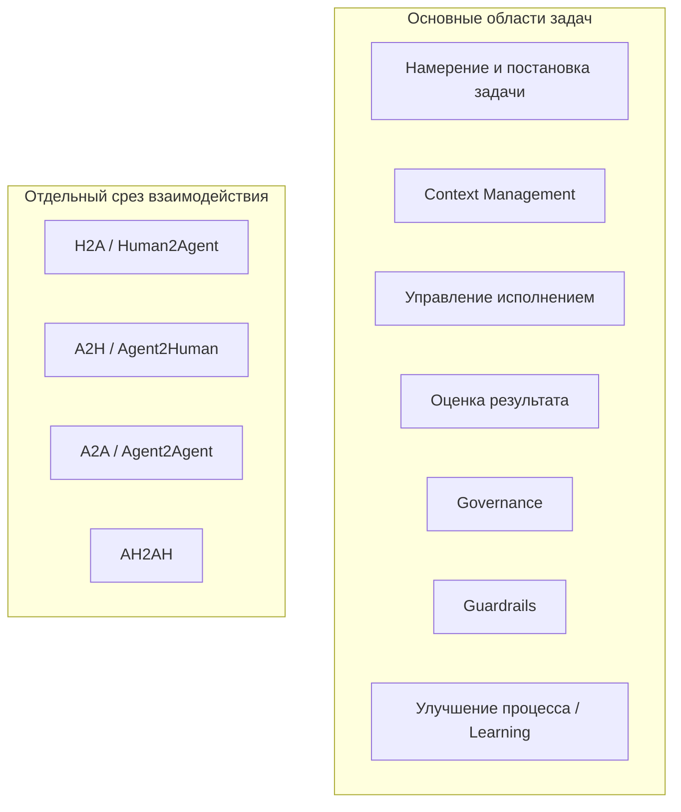

# Каталог компонентов AI-кодинга

> Синтез материалов из `docs/ai-coding-control-model/core` и `docs/ai-coding-control-model/research`.
> Цель: дать одну опорную модель для слайда, детального описания компонентов и общего глоссария.

---

## 1. Назначение документа

Этот файл сводит рабочие материалы в единую компонентную модель AI-кодинга.

Модель описывает не конкретные IDE, агенты или фреймворки, а управляемые области процесса, через которые проходит любое значимое AI-изменение в коде.

---

## 2. Верхнеуровневая карта для слайда

### 2.1. Основные области задач

Это не жизненный цикл, а карта основных областей задач в управляемом AI-кодинге. `Knowledge Freshness` здесь входит в `Context Management`, потому что актуальность знаний - часть управления контекстом и памятью.

По каждой области можно выделять блокеры, простые качественные метрики и сигналы из логов сессий: где агент потерял намерение, взял плохой контекст, неэффективно использовал инструменты, не доказал результат или обошёл ограничения. Без такой разметки непонятно, что именно пошло не так и что улучшать: промпты, контекст, скиллы, проверки, правила или оркестрацию.

Практический приём: регулярно анализировать завершённые AI-сессии и прямо спрашивать агента, что можно было сделать лучше, где он видел лишние итерации, нехватку контекста, слабые проверки или неясную постановку задачи. Ответ должен превращаться не в общие советы, а в конкретные улучшения: новые проверки, шаблоны, промпты, скиллы, правила или подсказки для команды.

| Область задач | Что включает | Вопросы оценки | Концепции / практики / примеры инструментов |
|---|---|---|---|
| **Намерение и постановка задачи** | намерение, цель, ограничения, что не входит в задачу, критерии приёмки, шаблоны промптов/спецификаций | Понятно ли зачем делаем? Насколько точны и детальны промпты? Есть ли границы и критерии готовности? Можно ли проверить результат? | SDD, OpenSpec, Spec Kit, GigaCode `/insight`, AI Coding Coach |
| **Context Management** | рабочий пакет контекста, долговременная память, память сессии, авторитетность источников, актуальность/рассинхрон между кодом, документацией, спецификациями, контрактами и памятью, статус и приоритет Markdown-артефактов, токен-бюджет, точечный поиск и извлечение, индексы, границы модулей, MCP/RAG | Насколько актуален контекст? Видит ли агент нужные источники? Понятно ли, чему доверять? Есть ли устаревание/рассинхрон? Понятно ли, какая спецификация главнее? Насколько эффективно расходуются токены? Находит ли агент нужное без загрузки лишнего? Помогает ли структура кода экономить контекст? Можно ли восстановить контекст? | Context Engineering, `GIGACODE.md`, DeepWiki, CodeIndexer, MCP/RAG, architecture-as-code, реестр документов/спецификаций, карта источников, пакет контекста, токен-бюджет |
| **Управление исполнением** | план, оркестрация, sandbox/worktree, разрешённые изменения, журнал запуска, журнал отклонений, инструменты, скиллы, субагенты, передача состояния, стратегия мерджа | Насколько исполнение соответствует намерению и границам задачи? Насколько эффективна оркестрация? Правильно ли выбраны инструменты, скиллы и субагенты? Не создаёт ли изменение мердж-конфликтов? Есть ли след действий и отклонений? Можно ли продолжить работу по переданному состоянию? | Codex/GigaCode/Claude Code, SuperPowers, оркестрация инструментов, маршрутизация скиллов, передача состояния субагенту, sandbox/worktree, заголовок операции, журнал запуска, worktree-per-agent, merge queue |
| **Оценка результата** | тесты, CI, компиляция, ревью, доказательства, приёмка, пробелы и остаточный риск | Какие проверки пройдены? Чем подтверждён результат? Закрыты ли критерии приёмки? Запущены ли именно нужные тесты? Можно ли проверить результат быстрее без потери качества? Что осталось непроверенным? | CI, выбор тестов по затронутым областям, инкрементальная компиляция, проверки контрактов/безопасности, маршрутизация ревью, пакет доказательств, контракт утверждение-доказательство |
| **Governance** | правила, роли, владельцы, права, зоны ответственности, приоритет источников, матрица согласований | Понятно ли кто владеет областью? Кто имеет право читать, менять и утверждать? Где явно описаны правила и роли? Кто принимает риск? | CODEOWNERS, карта владельцев, матрица прав, правила согласования, защита веток |
| **Guardrails** | применение правил к конкретному изменению: риск-гейты, защищённые пути, обязательные проверки, согласования, условия остановки | К какому риску отнесено изменение? Какие ограничения включаются? Можно ли продолжать без согласования? Какие проверки обязательны? | риск-гейты, защищённые пути, обязательные проверки, условия остановки, режимы контроля |
| **Улучшение процесса / Learning** | GigaCode `/insight`, AI Coding Coach, разбор завершённых сессий, рекомендации агента, фидбэк по проделанной работе, выявление автоматизируемых действий, повторяющиеся сбои, изменения процесса, новые проверки/шаблоны/промпты, создание скиллов, evals, улучшения после ревью | Какие сбои повторяются? Что агент рекомендует улучшить? Где были лишние итерации, слабый контекст или недостаточная проверка? Нужны ли новая проверка, шаблон, промпт, скилл или eval? Подтверждено ли улучшение? | GigaCode `/insight`, AI Coding Coach, скиллы SuperPowers, evals, Promptfoo, Langfuse, изменения процесса |

### 2.2. Отдельный срез: взаимодействие и эффективность

Это не часть карты основных областей задач, а другой срез: как человек и агент взаимодействуют, передают состояние и улучшают постановку задач.

| Канал | Что означает | Что контролируем |
|---|---|---|
| **H2A / Human2Agent** | человек формулирует намерение, задачу, ограничения, контекст и критерии готовности для агента | качество постановки задачи; киберриски входного контекста: секреты, инъекция промпта, небезопасные источники; GigaCode `/insight`, AI Coding Coach, шаблоны промптов/спецификаций |
| **A2H / Agent2Human** | агент задаёт вопросы, ставит задачи человеку, сообщает статус, объясняет план/изменения, эскалирует риск и передаёт итог | правовые риски и ответственность: кто принял решение, кто дал согласование, что зафиксировано в аудиторском следе |
| **A2A / Agent2Agent** | один агент передаёт другому контекст, задачу, доказательства или выводы ревью | киберриски передачи: отравление контекста, утечка данных, расширение прав, доверие к передаче состояния |
| **AH2AH / Agent+Human to Agent+Human** | связка человек+агент передаёт работу другой связке человек+агент | межкомандная передача, владение, границы ответственности, аудиторский след |

### 2.3. Упрощённый flow выполнения

```text
Намерение
  -> Интерпретация намерения
  -> Планирование
  -> Исполнение
  -> Тестирование
  -> Ревью
  -> Приёмка / решение по изменению
  -> Обновление документации и спецификаций
  -> Улучшение процесса

Guardrails не отдельный финальный шаг.
Они работают как сквозные гейты для планирования, исполнения, проверок и принятия результата.
H2A, A2H, A2A и AH2AH - отдельный срез взаимодействия, а не этап жизненного цикла.
```

Расшифровка:

| Этап | Смысл |
|---|---|
| **Намерение** | человек формулирует проблему, цель, ограничения и ожидаемый результат |
| **Интерпретация намерения** | агент уточняет смысл, собирает контекст и превращает запрос в проверяемую задачу |
| **Планирование** | фиксируются шаги, границы изменения, риски, проверки и условия остановки |
| **Исполнение** | агент меняет код и связанные артефакты в рамках согласованного плана |
| **Тестирование** | результат проверяется тестами, проверками контрактов/безопасности и доказательствами |
| **Ревью** | человек/агент проверяет изменения, доказательства, допущения и остаточные риски |
| **Приёмка / решение по изменению** | изменение принимается, возвращается на доработку или фиксируется пробел |
| **Обновление документации и спецификаций** | документация, спецификации, контракты и память приводятся в соответствие с принятым изменением |
| **Улучшение процесса** | повторяющиеся сбои превращаются в новые проверки, шаблоны, промпты, скиллы или правила |

Сквозной контроль: Guardrails ограничивают планирование, исполнение, проверки и принятие результата через риск-гейты, защищённые пути, обязательные согласования, обязательные проверки и условия остановки.

### 2.4. Диаграмма этапов



### 2.5. Диаграмма основных областей задач AI-кодинга



---

## 3. Идеи и инсайты

### 3.1. Инсайт: модель должна зависеть от концепций, а не от фреймворка

AI-кодинг не должен быть жёстко привязан к одному фреймворку или инструменту.

Сегодня команда использует OpenSpec, завтра другой фреймворк спецификаций, послезавтра меняет агентную IDE или CI-подход. Но базовые проблемы остаются теми же: намерение надо уточнить, контекст найти, риск оценить, изменение выполнить, результат проверить, знания обновить, ответственность зафиксировать.

Поэтому компоненты модели должны описывать не конкретный набор инструментов, а устойчивые концепции:

- намерение и критерии готовности;
- контекст, память и авторитетность источников;
- риск, права и Guardrails;
- план, исполнение и след действий;
- проверки, доказательства и приёмка;
- актуальность документов и спецификаций;
- обучение процесса по итогам сессий.

### 3.2. Инсайт: Vibe Coding и SDD как управляемый спектр

Модель не утверждает, что любая задача должна проходить через тяжёлый specification-driven процесс.

Практически команда всегда балансирует между двумя режимами:

| Режим | Когда уместен | Что обязательно даже в лёгком режиме | Главный риск |
|---|---|---|---|
| **Vibe Coding** | низкий риск, локальное изменение, быстрое исследование, прототип, черновик | понятное намерение, ограниченные границы, короткая проверка, честное “что не проверено” | быстрый код принимается за инженерно готовый результат |
| **SDD / Specification-Driven Development** | средний/высокий риск, контракт, публичный API, данные, безопасность, миграции, много владельцев | спецификация, критерии приёмки, оценка влияния и риска, план, доказательства, решение по актуальности знаний | процесс становится слишком тяжёлым и команда его обходит |

Ключевая идея:

```text
Vibe Coding и SDD - не враги.
Это два конца спектра контроля.

Задача участников команды - выбрать правильную глубину спецификации,
планирования, проверки и доказательств под риск конкретного изменения.
```

Практическая формула:

```text
Low risk:
  намерение + малые границы + локальная проверка + короткая фиксация доказательств.

Medium risk:
  спецификация изменения + критерии приёмки + план + заметка о влиянии + отчёт проверки.

High/Critical risk:
  согласованная спецификация + согласование владельца + риск-гейты
  + проверки контрактов/безопасности + пакет доказательств
  + решение по актуальности и согласованию знаний.
```

Это важно для презентации: зрелость AI-кодинга не в том, чтобы запретить быстрый режим, а в том, чтобы не применять быстрый режим там, где нужен управляемый engineering-процесс.

### 3.3. Идея: разбирайте завершённые сессии

После значимой AI-сессии полезно попросить агента сделать короткий разбор:

- что можно было сделать лучше;
- где постановка задачи, контекст, план или проверки были слабыми;
- какие проверки, шаблоны, промпты, скиллы или правила он рекомендует добавить.

Так сессия становится источником улучшений, а не просто разовым выполнением задачи.

### 3.4. Инсайт: контекстное окно всегда будет меньше проекта

Кода, документации и Markdown-файлов будет становиться больше, а контекстное окно агента всё равно останется ограничением.

Отсюда отдельная инженерная задача: не просто «дать агенту контекст», а помочь ему быстро найти нужную информацию и не потратить токены на шум.

Практический фокус:

- индексы по коду и документации;
- карты источников и владельцев;
- точечный поиск вместо загрузки больших файлов целиком;
- короткие выжимки контекста со ссылками на первоисточники;
- сжатие истории сессии до фактов, решений и открытых вопросов;
- контроль токен-бюджета как часть качества AI-сессии.

### 3.5. Инсайт: узкое место смещается в интеграцию и проверку

AI ускоряет написание кода, но не отменяет стоимость встраивания изменения в систему.

Рост кодовой базы почти всегда тянет за собой рост тестов, сборок, зависимостей, сложностей с ревью и конфликтов merge. Поэтому ключевой вопрос уже не только “может ли агент написать diff?”, а “может ли команда быстро и доказательно принять этот diff?”.

Нужны практики:

- выбирать проверки по затронутым областям и риску;
- запускать сначала быстрые проверки по изменённой части, а долгие проверки выносить в CI или параллельный запуск;
- до реализации понимать зону влияния изменения: какие модули и контракты затронуты, какие проверки нужны и кто должен ревьюить;
- направлять ревью к владельцам затронутых контрактов, модулей и рисков;
- разделять быстрые локальные проверки, обязательные gate-проверки и финальную приёмку;
- фиксировать, что не проверялось и какой риск остаётся.

### 3.6. Инсайт: код тоже должен стать удобным для контекста

Если агенту нужно держать в голове всё изменение, то структура кода начинает напрямую влиять на качество AI-кодинга.

Возможно, нам придётся иначе оформлять код: делать модули меньше, границы явнее, зависимости прозрачнее, а входные точки и контракты легче находимыми. Не потому что “так красивее”, а потому что иначе нужный кусок системы не помещается в контекст или требует слишком много токенов.

То, что раньше могло казаться излишеством, становится рабочей необходимостью:

- детальная документация кода и модулей;
- явные ADR и архитектурные решения;
- карты зависимостей и владельцев;
- архитектура системы рядом с кодом;
- architecture-as-code для схем, контрактов, диаграмм и правил;
- тщательное планирование архитектуры до реализации.

### 3.7. Инсайт: Markdown-артефактам нужен жизненный цикл

Большое количество спецификаций, ADR, runbooks и Markdown-документов создаёт новую проблему: агенту мало найти документ, нужно понять его статус, актуальность и приоритет.

Иначе старый черновик, локальная заметка или устаревшая спецификация будут выглядеть для агента так же убедительно, как актуальный источник истины.

Нужны практики управления такими артефактами:

- реестр спецификаций и документов;
- статус: draft, active, accepted, superseded, archived;
- владелец и область ответственности;
- приоритет источников при конфликте;
- правила обновления после изменения кода;
- отметки актуальности и причины устаревания;
- явное архивирование или промоция временных документов.

---

## 4. Детальное описание областей управления

Этот раздел детализирует не конкретные фреймворки, а устойчивые области управления AI-кодингом. OpenSpec, Spec Kit, Codex, GigaCode, Claude Code, CI/CD, RAG или MCP могут меняться; остаются задачи управления намерением, контекстом, правами, риском, исполнением, проверкой, знаниями и улучшением процесса.

`Knowledge Freshness` здесь рассматривается как детализация `Context Management`: актуальность знаний, статус Markdown-артефактов и приоритет источников нужны для правильного выбора контекста. `H2A`, `A2H`, `A2A` и `AH2AH` вынесены в отдельный срез взаимодействия, а не смешиваются с жизненным циклом выполнения.

### 4.1. Governance

**Определение:** задание правил, ролей, владельцев, прав и зон ответственности, в рамках которых агент может читать, менять, проверять и передавать результаты.

**Проблема, которую решает:** агент может действовать быстро, но без явных правил он не знает, какие источники авторитетны, какие файлы защищены, где нужен approval, какие проверки обязательны и когда временная заметка может стать знанием проекта.

Governance задаёт правила и владельцев. Guardrails применяют эти правила к конкретному изменению: ограничивают исполнение, проверки и принятие результата.

**Что входит:**

- модель авторитетности источников;
- реестр артефактов проекта;
- матрица операций агента;
- права записи и защищённые пути;
- правила согласования;
- риск-гейты по уровню риска;
- политика доказательств;
- жизненный цикл артефактов;
- требования к аудиту;
- правила работы с памятью и сгенерированными выжимками.

**Типовые артефакты:**

- `artifact-registry.md`;
- `operation-matrix.md`;
- `source-authority.md`;
- `write-permissions.md`;
- `protected-paths.yaml`;
- `proof-policy.md`;
- `freshness-rules.md`;
- `approval-rules.yaml`;
- `audit-log`.

**Ключевые вопросы:**

- Какой это тип артефакта?
- Кто владелец?
- Это источник истины, подсказка, доказательства или сгенерированный кеш?
- Можно ли агенту это менять напрямую?
- Какая проверка обязательна перед завершением?
- Когда артефакт устаревает?
- Что делать при конфликте источников?

**Типовые сбои:**

- результат поиска воспринимается как истина;
- агент молча переписывает ADR или trusted memory;
- журнал запуска становится “памятью проекта” без ревью;
- нет владельца знания;
- approval нужен, но gate отсутствует;
- одинаковая глубина контроля применяется к typo и к изменению auth.

**Практики улучшения:**

- ввести уровни авторитетности источников;
- разделить knowledge, work, доказательства и derived artifacts;
- задать заголовок операции перед значимой задачей;
- использовать risk-based control budget;
- хранить доказательства отдельно от итогового текста агента;
- делать правила машиночитаемыми там, где это возможно.

**Примеры адаптеров (заменяемые):**

- `AGENTS.md`, `CLAUDE.md`, `GIGACODE.md`;
- GitHub branch protection и CODEOWNERS;
- GitHub Actions, policy checks;
- режимы прав Claude/Codex;
- защищённые пути;
- Audit Logger;
- Policy Engine;
- internal developer platform.

---

### 4.2. Context Management

**Определение:** управление тем, что агент видит, откуда извлекает знания, чему доверяет и как экономит ограниченное контекстное окно.

**Короткая формула:**

```text
Контекст = выбранные данные + решения сессии + след действий.
Истина = авторитетный источник + актуальность + доказательства.
```

**Проблема, которую решает:** кода, тестов, спецификаций и Markdown-документов становится всё больше, а контекстное окно ограничено. Агент либо не видит важный источник, либо перегружает окно шумом, либо принимает устаревшую выжимку за правду.

Внутри этой области находится и `Knowledge Freshness`: контроль актуальности, статуса и приоритета знаний до, во время и после изменения.

**Что входит:**

- Context Engineering;
- поиск и извлечение;
- навигация от карты проекта к конкретным файлам;
- индексы по коду и документации;
- архитектурные карты и границы модулей;
- маршруты поиска от вопроса к источнику;
- пакет контекста;
- сжатие и переупаковка контекста;
- контекст по запросу;
- управление контекстным окном и токен-бюджетом;
- память проекта;
- память агента;
- память сессии;
- метаданные авторитетности;
- метаданные актуальности;
- конфликт источников.

**Типовые входы:**

- запрос пользователя;
- инструкции и repo rules;
- код, тесты, конфиги;
- спецификации, ADR, документация, контракты;
- MCP-источники: Jira, Confluence, Notion, logs;
- результаты команд;
- текущий diff;
- решения и допущения сессии.

**Типовые артефакты:**

- `context-pack.md`;
- `retrieval-report.md`;
- `source-map.md`;
- `authority-matrix.md`;
- `session-notes.md`;
- `handoff-summary.md`;
- `source-citations`;
- сгенерированная карта репозитория или индекс.

**Ключевые вопросы:**

- Что нужно знать для решения?
- Где это может лежать?
- Какой источник сильнее при конфликте?
- Что могло устареть?
- Что не стоит класть в окно целиком?
- Как найти нужное без загрузки лишнего?
- Понятны ли границы модулей, входные точки и зависимости?
- Где расходуются токены впустую?
- Какие решения сессии являются временными?
- Чем summary подтверждается?

**Типовые сбои:**

- сбой выбора контекста: агент не нашёл нужные тесты, спецификации или контракты;
- неоднозначная авторитетность: README, код и ADR противоречат друг другу;
- context rot: окно деградирует из-за шума, старых решений и перегруза;
- context poisoning: ошибка попала в устойчивый контекст и размножается в будущих задачах;
- сгенерированный пакет контекста воспринимается как источник истины;
- весь репозиторий грузится вместо точечного маршрута;
- большой модуль или файл требует загрузить слишком много контекста;
- архитектурное решение есть только в головах людей или старом чате.

**Практики улучшения:**

- начинать с карты, а не с чтения всего подряд;
- хранить route поиска отдельно от найденной истины;
- использовать индексы, карты источников и точечный поиск;
- держать архитектурные решения, карты модулей и владельцев рядом с кодом;
- проектировать модули так, чтобы их можно было понимать и менять без загрузки половины системы;
- помечать authority и freshness;
- делать переупаковку контекста с сохранением фактов, решений и открытых вопросов;
- держать активное состояние задачи коротким;
- подгружать контекст по запросу;
- контролировать токен-бюджет как показатель качества сессии;
- разделять “найденный кандидат” и “принятый факт”.

**Примеры адаптеров (заменяемые):**

- `rg`, code search, CodeIndexer;
- RAG по коду;
- DeepWiki или repo map;
- MCP;
- AGENTS.md и skills;
- vector index;
- context sanitizer;
- token budget dashboard.

#### 4.2.1. Актуальность знаний и жизненный цикл документов

**Определение:** детализация `Context Management`: контроль расхождений между кодом, документацией, спецификациями, контрактами, ADR, сгенерированными выжимками и памятью до, во время и после изменения.

До изменения важно выбрать актуальные источники и понять их приоритет. Во время изменения - проверять, не создаёт ли diff новый рассинхрон. После изменения - обновить, архивировать или явно пометить устаревшие документы, спецификации, контракты и записи памяти.

**Проблема, которую решает:** код изменился, а проектные знания остались прежними. При большом количестве спецификаций и Markdown-документов агенту трудно понять, какой документ актуален, какой является черновиком, какой устарел и какой источник главнее при конфликте. Для AI-агента устаревший уверенный Markdown опаснее, чем отсутствие Markdown.

**Что входит:**

- проверки актуальности знаний;
- drift между документацией и кодом;
- устаревание спецификаций;
- расхождение между спецификацией, кодом и тестами;
- согласование контрактов;
- предложение обновить ADR;
- перевод временной спецификации в стабильную;
- статус и приоритет для спецификаций и документов;
- жизненный цикл документов и спецификаций;
- инвалидация устаревших сгенерированных выжимок;
- жизненный цикл памяти проекта.

**Типовые артефакты:**

- `freshness-report.md`;
- `stale-facts.yaml`;
- `doc-update-proposal.md`;
- `contract-update.md`;
- `adr-update-proposal.md`;
- `doc-registry.md`;
- `spec-registry.md`;
- `source-priority.md`;
- `reconciliation-checklist.md`;
- `archive-note.md`.

**Ключевые вопросы:**

- Какие знания могут устареть из-за планируемого или выполненного изменения?
- Нужно ли обновить документацию, спецификации, контракты, ADR или runbooks?
- Какой статус у документа: draft, active, accepted, superseded или archived?
- Какой источник приоритетнее при конфликте?
- Что должно быть архивировано?
- Какие сгенерированные выжимки контекста больше нельзя использовать?
- Какие выводы сессии можно перенести в память проекта?
- Кто должен проверить обновление?

**Типовые сбои:**

- Knowledge Drift: документация, спецификации и контракты расходятся с кодом;
- change spec принимается за stable spec;
- черновик воспринимается как принятое решение;
- две спецификации противоречат друг другу, но приоритет не задан;
- ADR переписан задним числом без ревью;
- старые выжимки попадают в будущий контекст;
- актуальность определяется только LLM-оценкой без проверяемых сигналов.

**Практики улучшения:**

- сначала использовать проверяемые сигналы: изменённые пути, schema diff, contract diff, CODEOWNERS;
- явно фиксировать триггеры обновления знаний в реестре артефактов;
- вести реестр документов и спецификаций со статусом, владельцем и приоритетом;
- задавать жизненный цикл для временных артефактов после merge;
- явно описывать правила промоции draft -> accepted и архивирования superseded docs;
- сгенерированные индексы пересоздавать, а не редактировать руками;
- переносить выводы в стабильное знание только через ревью;
- инвалидировать устаревшие выжимки.

**Примеры адаптеров (заменяемые):**

- OpenAPI diff;
- schema validation;
- docs lint;
- contract tests;
- CODEOWNERS;
- generated repo maps;
- knowledge base updater;
- генерация release notes с ревью.

---

### 4.3. Намерение и постановка задачи / SDD

**Определение:** превращение человеческого запроса в проверяемую задачу: намерение, цель, ограничения, что не входит в задачу, ожидаемое поведение и критерии приёмки.

**Проблема, которую решает:** намерение остаётся в чате, контекст распадается, агент начинает реализацию по приблизительному пониманию, границы задачи расползаются, а результат невозможно принять объективно.

SDD здесь не “документ ради документа”, а способ стабилизировать контекст. Если бы агент всегда идеально удерживал намерение, ограничения, историю решений и критерии проверки, потребность в спецификациях была бы намного ниже.

**Что входит:**

- фиксация намерения;
- уточняющие вопросы;
- границы задачи и то, что не входит в задачу;
- ожидаемое поведение;
- затронутые области;
- ограничения;
- допущения;
- открытые вопросы;
- критерии приёмки;
- заготовка плана проверки;
- conversation-to-contract gate.

**Типовые артефакты:**

- `intent.md`;
- `change-spec.md`;
- `requirements.md`;
- `design.md`;
- `acceptance.md`;
- `open-questions.md`;
- OpenSpec change;
- GitHub issue template;
- Spec Kit artifacts.

**Ключевые вопросы:**

- Какую проблему человек хочет решить?
- Что должно измениться в поведении?
- Что точно не входит в задачу?
- Какие ограничения нельзя нарушить?
- Как проверить готовность?
- Какие вопросы нельзя угадать без человека?

**Типовые сбои:**

- Intent Loss: смысл остался только в переписке;
- Scope Ambiguity: агент делает больше или иначе, чем ожидалось;
- Premature Implementation: код пишется до критериев готовности;
- acceptance criteria формальны и не проверяют реальное ожидание;
- change spec после merge не архивируется и не промотируется в stable knowledge.

**Практики улучшения:**

- правило “нет нетривиальной реализации без намерения и критериев приёмки”;
- различать лёгкую фиксацию намерения для Vibe Coding и формальную спецификацию изменения для SDD;
- шаблоны change spec по уровню риска;
- явное описание того, что не входит в задачу;
- примеры и граничные случаи;
- связывать каждый acceptance criterion с будущей проверкой;
- отделять stable spec от proposed change.

**Примеры адаптеров (заменяемые):**

- OpenSpec;
- GitHub Spec Kit;
- Kiro Specs;
- issue templates;
- product requirement templates;
- acceptance checklist;
- BDD/Gherkin там, где полезно.

---

### 4.4. Guardrails

**Определение:** ограничения и обязательные проверки, которые переводят риск конкретного изменения в правила исполнения, ревью и принятия результата.

**Проблема, которую решает:** агент меняет локальный файл, но не видит API, контракты, схемы данных, границы безопасности, downstream consumers и владельцев. Без Guardrails риск остаётся абстрактной оценкой и не превращается в конкретные действия.

**Что входит:**

- оценка зоны влияния изменения;
- затронутые модули, API, контракты и схемы;
- миграции и обратная совместимость;
- киберриски, privacy и защищённые области;
- владельцы и обязательные согласования;
- риск-гейты и условия остановки;
- обязательные проверки по типу изменения;
- план отката;
- release/runtime risk.

**Типовые артефакты:**

- `impact-report.md`;
- `affected-areas.md`;
- `risk-note.md`;
- `owner-map.md`;
- `dependency-map.md`;
- `test-selection.md`;
- `approval-record.md`;
- `rollback-plan.md`.

**Ключевые вопросы:**

- Какие модули, API и контракты затронуты?
- Кто владеет этими областями?
- Какова цена ошибки?
- Какие проверки обязательны для этого риска?
- Нужны ли архитектурное ревью, security review или ревью контракта?
- Можно ли агенту исполнять задачу автономно?

**Режимы контроля по риску:**

| Риск | Типичный режим | Автономность агента | Контроль человека | Минимальные доказательства |
|---|---|---|---|---|
| Low | Vibe Coding с границами | высокая | ревью после изменения | краткое описание diff, локальная проверка или объяснение |
| Medium | облегчённый SDD | умеренная | согласование плана перед реализацией | критерии приёмки, impact note, тесты, список изменённых файлов |
| High | SDD с owner gates | низкая | согласование спецификации и плана | CI, проверки контрактов/безопасности, ревью владельца |
| Critical | human-led, agent-assisted | очень низкая | решения ведёт человек | формальное ревью, аудиторский след, план отката |

**Решение Guardrails:**

Guardrails должны выдавать не только оценку риска, но и обязательное решение для исполнения.

| Решение | Что фиксирует |
|---|---|
| Уровень риска | low, medium, high, critical |
| Режим работы | Vibe Coding with boundaries, lightweight SDD, SDD with owner gates, human-led |
| Разрешённые зоны записи | какие области можно менять без дополнительного согласования |
| Обязательные согласования | кто должен согласовать спецификацию, план, защищённые пути или release |
| Обязательные проверки | тесты, CI, контракты, безопасность, миграции, документы и актуальность знаний |
| Минимум доказательств | минимальный набор доказательств для завершения |
| Триггеры согласования знаний | какие документы, спецификации, контракты и записи памяти надо проверить после diff |

**Типовые сбои:**

- Impact Blindness: не найдена зависимость, которую ломает изменение;
- OpenAPI или schema не обновлены;
- не подключён владелец;
- проверка не соответствует риску;
- агент обходит approval через “маленький” diff;
- изменение в чувствительной зоне безопасности проверяется как обычный рефакторинг;
- Vibe Coding применяется к задаче, где нужен SDD;
- SDD применяется к простой задаче и создаёт лишние накладные расходы.

**Практики улучшения:**

- risk tags для задач;
- protected areas;
- CODEOWNERS и карта владельцев;
- проверки route/API/schema diff;
- сначала проверяемые сигналы по влиянию и актуальности знаний;
- чеклисты по типам изменений.

**Примеры адаптеров (заменяемые):**

- CODEOWNERS;
- dependency graph;
- OpenAPI diff;
- schema diff;
- security scanners;
- threat model templates;
- PR labels и обязательные ревьюеры;
- policy-as-code.

---

### 4.5. Управление исполнением / Orchestration

**Определение:** управление тем, как агент выполняет работу: план, фазы, инструменты, sandbox/worktree, права, журналы действий, отклонения, скиллы, субагенты и передача состояния.

**Проблема, которую решает:** “агент пишет код” без фаз, границ и следа работы. В итоге непонятно, почему он сделал изменение, какие команды запускал, где отклонился от плана, какие инструменты выбрал и можно ли продолжать сессию.

**Что входит:**

- объявление режима работы;
- фазы: уточнение, поиск контекста, анализ, планирование, реализация, проверка, приёмка, обновление знаний, handoff;
- план и контрольные точки;
- стратегия мерджа и разбиения изменения;
- права и согласования;
- границы sandbox/worktree/container;
- разрешённые инструменты;
- журнал команд;
- журнал решений;
- журнал отклонений;
- список изменённых файлов;
- условия остановки;
- handoff summary.

**Типовые артефакты:**

- `operation-header.yaml`;
- `execution-plan.md`;
- `plan-approval.md`;
- `run-log.md`;
- `commands-run.md`;
- `decision-trace.md`;
- `deviation-log.md`;
- `changed-files.md`;
- `merge-plan.md`;
- `handoff-summary.md`.

**Ключевые вопросы:**

- Какая операция сейчас выполняется?
- Какие артефакты задействованы?
- Есть ли checkpoint плана перед реализацией?
- Что агенту разрешено читать и менять?
- Какие действия требуют согласования?
- Как изменение будет безопасно влито без лишних конфликтов?
- Какой результат должен появиться?
- Как фиксируются отклонения?
- Что должно остановить исполнение?

**Пример operation header:**

```yaml
operation:
  mode: impact-analysis
  target_artifacts:
    - changes/add-refresh-token-auth/
    - contracts/openapi.yaml
    - specs/current/auth.md
  allowed_actions:
    - read
    - search
    - create impact report
  forbidden_actions:
    - edit production code
    - rewrite stable specs
  outputs:
    - changes/add-refresh-token-auth/affected-areas.md
    - changes/add-refresh-token-auth/verification-plan.md
```

**Типовые сбои:**

- Execution Drift: агент уходит в соседний refactor;
- зацикливание и лишние действия;
- изменение посторонних файлов;
- ослабление тестов ради прохождения;
- нет журнала запуска;
- следующий агент не может восстановить состояние;
- agent mode выбран неправильно и gate это не ловит.

**Практики улучшения:**

- явно выделять `plan` как отдельную операцию, а не как комментарий перед кодом;
- контрольные точки по фазам;
- условия остановки;
- разрешённые и запрещённые пути;
- worktree-per-agent;
- согласование плана для задач среднего/высокого риска до перехода к реализации;
- делить большие изменения на части с понятной стратегией мерджа;
- заранее проверять пересечения с защищёнными областями и активными изменениями;
- использовать merge queue или аналог там, где много параллельных AI-изменений;
- классификация отклонений: ожидаемое, безвредное, требует согласования, требует отката;
- повторно используемые рецепты для типовых задач.

**Plan checkpoint:**

```text
Plan фиксирует порядок действий, границы записи, обязательные проверки,
ожидаемые результаты, условия остановки и путь сбора доказательств.

Для задач среднего/высокого риска переход к реализации без плана запрещён.
Для низкого риска план может быть коротким: границы + файлы + локальная проверка.
```

**Примеры адаптеров (заменяемые):**

- Codex;
- Claude Code;
- GigaCode;
- GitHub Copilot coding agent;
- Jules;
- SuperPowers;
- GSD/GStack;
- CI harness;
- browser/test harnesses;
- containerized dev environments.

---

### 4.6. Оценка результата / Проверка и доказательства

**Определение:** проверка результата относительно критериев готовности и сбор доказательств, по которым человек или команда могут принять изменение.

**Проблема, которую решает:** агент говорит “готово” или “тесты прошли”, но непонятно, что именно проверялось, какие критерии закрыты, какие риски остались и можно ли принять результат.

**Что входит:**

- план проверки;
- выбор проверок по затронутым областям;
- unit, integration, e2e и smoke-тесты;
- typecheck и lint;
- инкрементальная компиляция;
- кеши и параллельные проверки;
- проверки контрактов;
- проверки безопасности;
- проверки миграций;
- ручная проверка;
- результат CI;
- скриншоты и логи;
- чеклист приёмки;
- заметки ревью;
- пакет доказательств;
- известные пробелы.

**Типовые артефакты:**

- `verification-report.md`;
- `proof-bundle.md`;
- `check-plan.md`;
- `test-selection.md`;
- `test-results.md`;
- `compile-report.md`;
- `ci-link`;
- `contract-check-report.md`;
- `security-check-report.md`;
- `review-routing.md`;
- `review-notes.md`;
- `screenshots`;
- `known-gaps.md`.

**Формула готовности:**

```text
Готово =
критерии готовности закрыты
+ доказательства приложены
+ известные пробелы названы.
```

**Контракт утверждение-доказательство:**

Каждое финальное утверждение агента должно быть подкреплено доказательствами или явно помечено как непроверенное.

| Утверждение | Нужные доказательства |
|---|---|
| “Критерий приёмки выполнен” | id критерия, ссылка на diff/код, команда или проверка, результат |
| “Тесты прошли” | команда, окружение, timestamp или ссылка на CI, результат |
| “Контракт не сломан” | результат проверки контракта |
| “Документация актуальна” | решение по актуальности: updated или not affected |
| “Не проверено” | явный пробел, причина, остаточный риск |

**Ключевые вопросы:**

- Какие критерии приёмки проверены?
- Какими командами и результатами это подтверждено?
- Что проверялось автоматически, а что вручную?
- Почему выбран именно этот набор тестов?
- Можно ли ускорить проверку через инкрементальную компиляцию, кеши или параллельный запуск?
- Какие контракты и границы безопасности затронуты?
- Кто должен ревьюить изменение по затронутым областям?
- Какие проверки не запускались и почему?
- Какие остаточные риски остаются?

**Типовые сбои:**

- поверхностная проверка: один test pass заменяет полную проверку;
- пробел доказательств: нет команд, логов, сводки изменений или ссылки на CI;
- проверка не связана с критериями приёмки;
- контракт сломан, но unit-тесты зелёные;
- документация или спецификация устарели, но задача помечена как выполненная;
- запущен слишком узкий набор тестов;
- запущено слишком много проверок без связи с риском и изменением;
- мердж-конфликт найден только в конце работы;
- ревью попало не к владельцу области;
- LLM-as-judge используется как единственная проверка.

**Практики улучшения:**

- политика доказательств;
- сводка утверждений и доказательств;
- связка критериев готовности с тестами;
- выбор тестов по затронутым областям;
- инкрементальная компиляция и кеширование;
- параллельный запуск долгих проверок;
- маршрутизация ревью по владельцам и CODEOWNERS;
- обязательные проверки по риску;
- сохранять исходные выводы команд или ссылки;
- явно писать “не проверено”;
- использовать evals для повторяемых агентных задач.

**Примеры адаптеров (заменяемые):**

- CI/CD;
- pytest, npm test, cargo test и другие локальные runners;
- static analysis;
- contract testing;
- security scanners;
- SWE-bench-like evals;
- Promptfoo/Langfuse для prompt/workflow evals;
- PR review assistants.

---

### 4.7. Отдельный срез: H2A / A2H / A2A / AH2AH

**Определение:** коммуникационная и контрольная плоскость AI-кодинга: человек-агент, агент-человек, агент-агент и передача между связками человек+агент.

Это не этап жизненного цикла и не отдельная область исполнения. Это срез, который показывает, как намерение, статус, решения, риски и доказательства переходят между участниками работы.

| Канал | Что означает | Типовые ситуации |
|---|---|---|
| **H2A / Human2Agent** | человек формулирует намерение, ограничения, контекст и критерии готовности | постановка задачи, уточнение границ, передача контекста, выбор режима работы |
| **A2H / Agent2Human** | агент объясняет, спрашивает, ставит задачи человеку, эскалирует и передаёт состояние | уточнение, approval, задача на ревью, запрос доступа, запрос решения, финальная сводка |
| **A2A / Agent2Agent** | один агент передаёт состояние, доказательства или задачу другому агенту | handoff, параллельное ревью, специализированный субагент |
| **AH2AH / Agent+Human to Agent+Human** | одна связка человек+агент передаёт работу другой связке | передача между командами, передача роли, ревью у владельцев |

**Доминирующие риски по каналам:**

| Канал | Основной риск | Что контролировать |
|---|---|---|
| **H2A** | киберриски входного контекста | секреты, инъекция промпта, небезопасные источники, избыточный контекст |
| **A2H** | правовые риски и ответственность | кто принял решение, что агент поручил человеку, где approval, что попало в аудиторский след |
| **A2A** | киберриски передачи между агентами | отравление контекста, утечка данных, расширение прав, доверие к handoff |
| **AH2AH** | риск потери владения при передаче между связками | границы ответственности, межкомандный handoff, аудиторский след |

**Проблема, которую решает:** агент выполняет работу как чёрный ящик. Человек видит только diff или финальное “готово” и не может вовремя остановить расползание границ, проверить допущения или принять риск.

**Что входит:**

- уточнение намерения;
- статусы выполнения;
- задачи человеку: ревью, согласование, запрос доступа, запрос решения;
- объяснение использованного контекста;
- объяснение плана;
- допущения;
- вопросы и эскалации;
- запросы согласования;
- объяснение компромиссов;
- объяснение diff;
- объяснение проверок;
- финальная сводка;
- handoff человеку или следующему агенту.

**Типовые артефакты:**

- `question.md`;
- `status-update`;
- `approval-request.md`;
- `decision-rationale.md`;
- `handoff-summary.md`;
- PR summary;
- комментарии ревью;
- финальная сводка утверждений и доказательств.

**Ключевые вопросы:**

- Что агент понял?
- Какие допущения он принял?
- Где он не уверен?
- Что он собирается менять?
- Какие решения требуют человека?
- Что изменилось относительно плана?
- Как человеку быстро проверить результат?

**Типовые сбои:**

- человек узнаёт о риске только в конце;
- агент не спрашивает, когда надо;
- финальная сводка не связана с критериями приёмки;
- diff непонятен ревьюеру;
- handoff не позволяет продолжить работу;
- человек превращается в пассивного наблюдателя вместо владельца намерения и риска.

**Практики улучшения:**

- короткие, но регулярные статусы;
- явные допущения;
- запросы согласования, привязанные к Governance и Guardrails;
- протокол handoff;
- явное различение: “сделано”, “проверено”, “не проверено”;
- сводки, готовые для ревью;
- правила эскалации.

**Примеры адаптеров (заменяемые):**

- Codex/GigaCode/Claude Code chat;
- PR summaries;
- issue comments;
- review assistants;
- session handoff protocol;
- IDE notifications;
- AI Engineer Coach.

---

### 4.8. Улучшение процесса / Learning

**Определение:** контур улучшения процесса, который превращает доказательства, находки ревью, повторяющиеся сбои и evals в проверенные изменения правил, навыков, шаблонов, промптов, скиллов и инструментов.

**Проблема, которую решает:** агент повторяет одни и те же ошибки, но процесс не учится. При этом “скорость генерации кода” ошибочно принимается за реальную эффективность.

**Что входит:**

- разбор завершённых AI-сессий;
- таксономия повторяющихся сбоев;
- GigaCode `/insight`;
- eval-driven development;
- capability evals;
- regression evals;
- prompt/workflow evals;
- улучшение шаблонов;
- предложения новых проверок;
- предложения новых или обновлённых скиллов;
- жизненный цикл инструментов;
- метрики эффективности связки человек-агент;
- экономика токенов.

**Типовые артефакты:**

- `retrospective.md`;
- `process-patch.md`;
- `insight.md`;
- `eval-fixture`;
- `eval-report.md`;
- `recipe-update-proposal.md`;
- `new-gate-proposal.md`;
- `productivity-notes.md`;
- metrics dashboard.

**Ключевые вопросы:**

- Какие ошибки повторяются?
- Какая проверка предотвратила бы ошибку?
- Какой шаблон уменьшит усилие на ревью?
- Улучшение подтверждено доказательствами или только ощущением?
- Насколько точно человек формулирует намерение, задачу, ограничения и критерии приёмки для агента?
- Стал ли человек быстрее и спокойнее принимать результат?
- Снизились ли доработки, когнитивная нагрузка и частота вмешательства человека?

**Human2Agent Effectiveness:**

Это отдельный фокус внутри эффективности: не “насколько агент умный”, а насколько хорошо человек управляет агентом через намерение, постановку задачи, ограничения и критерии готовности.

Эта метрика относится к отдельному срезу H2A/A2H/A2A/AH2AH, а в `Learning` используется как источник улучшений для шаблонов, подсказок, скиллов и правил постановки задач.

| Что измеряем | Типичный сигнал | Как улучшаем |
|---|---|---|
| Точность намерения | агент переспрашивает, уходит не туда, меняет лишнее | шаблон намерения, примеры, явные исключения из задачи |
| Качество постановки задачи | нет границ, ограничений, затронутых областей | AI Coding Coach, IDE extension, чеклист |
| Проверяемость задачи | нет критериев приёмки или они формальные | чеклист приёмки, ревью спецификации |
| Цена коммуникации | много уточнений, долгое ревью, доработки | GigaCode `/insight`, повторно используемые промпты, лучший handoff |

**Поток улучшения процесса:**

```text
Наблюдение -> Инсайт -> Предложение -> Ревью -> Принятое изменение
```

| Шаг | Смысл | Результат |
|---|---|---|
| Наблюдение | найден повторяющийся сбой, трение или пробел | сырая заметка, находка ревью, инцидент |
| Инсайт | сформулирована причина и повторяющийся паттерн | `insight.md` |
| Предложение | предложено изменение процесса, шаблона, проверки, скилла или eval | `process-patch.md` |
| Ревью | владелец процесса принимает или отклоняет предложение | запись решения |
| Принятое изменение | обновлён управляющий артефакт, шаблон, проверка или eval | проверенное правило, шаблон или проверка |

**Модель измерения:**

Метрика не является улучшением сама по себе. Для каждой метрики нужны владелец, периодичность, способ расчёта и решение, которое эта метрика поддерживает.

| Область метрик | Пример метрики | Какое решение поддерживает |
|---|---|---|
| Качество работы агента | точность с первой попытки, полнота доказательств | какие рецепты и проверки улучшать |
| Усилие человека | усилие на ревью, когнитивная нагрузка | где агент добавляет накладные расходы |
| Поток поставки | время от намерения до проверенного изменения, доля доработок | где процесс тормозит |
| Стоимость контроля | частота вмешательства человека, время ожидания согласований | где контроль чрезмерен или слаб |
| Качество знаний | актуальность документов и спецификаций после изменения | где нужен гейт актуальности |

**Метрики агента:**

- точность понимания намерения;
- качество контекста;
- дисциплина токен-бюджета;
- точность с первой попытки;
- доля доработок;
- качество проверки;
- полнота доказательств;
- качество объяснений;
- стоимость по времени и командам.

**Метрики системы человек-агент:**

- время от намерения до проверенного изменения;
- усилие на ревью;
- когнитивная нагрузка;
- частота вмешательства человека;
- соответствие спецификации;
- доверие, откалиброванное доказательствами;
- lead time;
- дефекты, ушедшие дальше;
- актуальность документов и спецификаций после изменения.

**Типовые сбои:**

- процесс не учится: повторяющиеся сбои не превращаются в проверки;
- скрытое самоизменение: агент сам меняет доверенные правила без ревью;
- evals оптимизируют бенчмарк, но не реальную пользу;
- трение инструментов не измеряется;
- TokenOps отсутствует и стоимость AI-исполнения не видна;
- продуктивность выводится только из субъективного ощущения.

**Практики улучшения:**

- улучшать процесс через ревью, а не через скрытую self-modification;
- добавлять проверку только при понятном владельце, жизненном цикле и доказательствах;
- связывать insight с конкретным сбоем;
- регрессионные evals для агентных workflow;
- “золотые пути” и готовые маршруты для типовых задач;
- измерять эффективность связки человек-агент, а не только скорость агента.

**Примеры адаптеров (заменяемые):**

- GigaCode `/insight`;
- AI Coding Coach / IDE extension;
- Promptfoo;
- Langfuse;
- SWE-bench-like eval harnesses;
- review metrics;
- CI analytics;
- developer surveys;
- IDP dashboards.

---

## 5. Глоссарий

Ниже оставлены только термины, которые важны именно для AI agent coding или получают в нём специальный смысл. Обычные software engineering термины вроде `review`, `owner`, `scope`, `CI`, `policy`, `sandbox`, `worktree` и `acceptance criteria` здесь не раскрываются отдельно.

### Agentic Software Engineering

Подход к software engineering, где AI-агенты участвуют не только в генерации кода, но и в анализе, планировании, проверке, документации, передаче состояния и улучшении процесса.

### AI Coding Control Model

Модель управления AI-кодингом, которая описывает устойчивые проблемы и области контроля независимо от конкретного агента, IDE, фреймворка спецификаций или CI/CD-подхода.

### Governance

Слой правил, ролей, владельцев, прав и зон ответственности. В AI agent coding Governance важно потому, что агенту нужно заранее понимать, какие источники авторитетны, какие области защищены и где требуется согласование человека.

### Coding Agent

AI-агент, который работает с кодовой базой через инструменты: читает файлы, ищет контекст, планирует, меняет код, запускает проверки, собирает доказательства и передаёт результат человеку или другому агенту.

### Context Management

Область управления тем, что агент видит, откуда извлекает знания, чему доверяет и как расходует контекстное окно. Включает рабочий контекст, память, поиск, приоритет источников, актуальность знаний и токен-бюджет.

### Context Engineering

Дисциплина отбора, структурирования, сжатия, изоляции и подачи контекста агенту. В AI-кодинге это ключевая практика, потому что проект всегда больше контекстного окна.

### Context Window

Ограниченный объём информации, который модель может учитывать в текущем вызове. Рост кода, тестов и Markdown-документов делает управление этим ограничением отдельной инженерной задачей.

### Context Pack

Короткая выжимка релевантного контекста для задачи: источники, ссылки, факты, решения, допущения и пробелы. Context pack помогает агенту работать точечно, но сам не является источником истины.

### Context Compaction

Переупаковка активного контекста: сохранить факты, решения, открытые вопросы и ссылки на источники, но убрать шум, устаревшие детали и длинную историю сессии.

### Just-in-Time Context

Подгрузка нужного контекста в момент необходимости вместо загрузки больших файлов и всего репозитория заранее.

### Context Rot

Деградация качества контекста из-за шума, устаревших решений, перегруза окна, старых summary и неподтверждённых выводов.

### Context Poisoning

Попадание ошибки, галлюцинации, небезопасной инструкции или malicious content в контекст или память с последующим повторным использованием агентом.

### Prompt Injection

Атака или случайная ошибка, при которой внешнее содержимое пытается изменить поведение агента: заставить игнорировать правила, раскрыть секреты, выполнить лишние действия или довериться неподтверждённому источнику.

### Context Sanitizer

Практика или инструмент очистки контекста от секретов, PII, небезопасных источников и инструкций, которым агент не должен доверять.

### MCP/RAG

Подходы и интеграции для извлечения внешнего контекста: MCP подключает агента к источникам и инструментам, RAG помогает находить релевантные знания. Оба требуют правил авторитетности, безопасности и актуальности источников.

### Token Budget / TokenOps

Управление токенами как операционным ресурсом AI-сессии: что положить в контекст, что сжать, что искать по запросу, где тратятся токены впустую и как это влияет на качество результата.

### Project Memory

Долговременное знание проекта: архитектура, спецификации, контракты, ADR, runbooks, правила и принятые решения. Не вся память проекта является истиной без владельца, источника и жизненного цикла.

### Agent Memory

Знания и навыки, связанные с агентом: инструкции репозитория, предпочтительные workflows, skills, reusable prompts и процедурные правила.

### Session Memory

Временное состояние текущей AI-сессии: план, допущения, решения, команды, изменённые файлы, результаты проверок, отклонения и handoff.

### Source Authority

Понимание, какому источнику доверять по конкретному вопросу. Для фактического поведения сильнее код, тесты и runtime-подтверждения; для ожидаемого поведения - стабильные спецификации и контракты; для обоснования решений - ADR.

### Authority Matrix

Правила приоритета источников при конфликте: code vs spec, spec vs ADR, docs vs runtime, session note vs accepted knowledge.

### Generated / Derived Artifact

Пересоздаваемый артефакт доступа: сгенерированный индекс, карта репозитория, результат поиска, выжимка, пакет контекста. Он помогает найти путь, но не должен становиться источником истины.

### Specification-Driven Development / SDD

Режим, где спецификация становится управляющим артефактом между человеком, агентом и кодовой базой: фиксирует намерение, ограничения, критерии приёмки, план и проверки.

### Vibe Coding

Быстрый режим AI-кодинга, где человек задаёт направление, агент быстро меняет код, а спецификация минимальна или живёт в чате. Уместен для низкорисковых локальных изменений, но опасен для контрактов, безопасности, данных и миграций.

### Balanced Control

Принцип выбора глубины спецификации, планирования, проверки и доказательств по риску задачи: не всё должно быть SDD, но не всё можно делать как Vibe Coding.

### Change Spec

Описание proposed delta: что меняется сейчас. Change spec не равен stable spec после merge и должен быть принят, архивирован или промотирован.

### Stable Spec

Актуальное intended behavior проекта. После изменения поведения stable spec нужно обновить или явно подтвердить, что она не затронута.

### Conversation-to-Contract Gate

Контрольная точка, где разговорное намерение превращается в проверяемую задачу перед реализацией: цель, границы, non-goals, критерии приёмки и проверки.

### Guardrails

Ограничения и обязательные проверки, которые переводят риск изменения в правила исполнения, ревью и принятия результата: защищённые пути, согласования, риск-гейты, условия остановки, обязательные проверки.

### Risk-Based Control Budget

Принцип, по которому автономность агента, глубина SDD, обязательные проверки и требования к доказательствам зависят от риска изменения.

### Agent Operation Matrix

Матрица, которая описывает операции агента: что операция читает, что пишет, какие gates и владельцы нужны, какое состояние меняется и какие доказательства должны появиться.

### Operation Header

Явное объявление агентом текущего режима работы: цель операции, целевые артефакты, разрешённые действия, запрещённые действия и ожидаемые результаты.

### Execution Plan

План агентной работы с фазами, границами записи, обязательными проверками, условиями остановки и путём сбора доказательств.

### Run Log

След исполнения агентной сессии: команды, результаты, решения, изменённые файлы, ошибки и отклонения. Журнал запуска не является памятью проекта без ревью.

### Deviation Log

Журнал отклонений от плана или границ задачи с классификацией: ожидаемое, безвредное, требует согласования, требует отката.

### Handoff / Session Handoff Protocol

Передача состояния человеку или следующему агенту: что сделано, что решено, что проверено, что не проверено, какие риски и вопросы остались.

### Пакет доказательств

Набор проверяемых подтверждений результата: сводка изменений, команды, вывод тестов, ссылки на CI, скриншоты, заметки ревью, известные пробелы.

### Claim-Evidence Contract

Правило: каждое финальное утверждение агента должно иметь доказательство или явную пометку “не проверено”. Например, “тесты прошли” требует команды, окружения и результата.

### LLM-as-Judge

Использование модели как оценщика. Полезно для семантических evals, но не должно заменять проверяемые автоматические проверки там, где они возможны.

### Eval-Driven Development

Улучшение агента, prompt, workflow, checks и skills через систематические evals, а не только через субъективное ощущение качества.

### Capability Eval

Оценка того, способен ли агент выполнять определённый класс задач: найти контекст, составить план, проверить результат, сделать handoff.

### Regression Eval

Проверка, что изменение prompt, workflow, toolchain или skills не ухудшило уже достигнутое качество агентной работы.

### Freshness

Актуальность знаний проекта относительно текущего кода, спецификаций, контрактов и runtime reality.

### Knowledge Freshness

Контроль актуальности знаний в AI agent coding: какие документы, спецификации, контракты, выжимки и записи памяти ещё соответствуют текущему состоянию проекта, а какие нужно обновить, архивировать или инвалидировать.

### Knowledge Drift

Рассинхрон между кодом и знаниями: документация, спецификации, ADR, факты, сгенерированные выжимки, Confluence или память агента.

### Reconciliation

Согласование изменений кода с документацией, спецификациями, контрактами, ADR и памятью проекта после принятия изменения.

### Human Control Loop

Двусторонний контур управления между человеком и агентом: намерение, вопросы, согласования, ревью, объяснения, handoff и принятие риска.

### H2A / Human2Agent

Канал, где человек направляет агента: формулирует намерение, задачу, ограничения, контекст и критерии готовности.

### A2H / Agent2Human

Канал, где агент обращается к человеку: задаёт вопрос, объясняет план или diff, просит approval, эскалирует риск, передаёт summary или ставит задачу человеку.

### A2A / Agent2Agent

Канал передачи состояния между агентами: контекст, задача, доказательства, находки ревью, ограничения и handoff.

### AH2AH / Agent+Human to Agent+Human

Канал передачи работы между связками человек+агент: например, от разработчика с агентом к архитектору с агентом или от одной команды к другой.

### Human2Agent Effectiveness

Насколько эффективно человек управляет агентом через постановку задачи: точность намерения, полнота контекста, границы, что не входит в задачу, критерии приёмки.

### Human-Agent System Effectiveness

Системная метрика пользы всей связки человек-агент: скорость проверенного изменения, качество доказательств, усилие на ревью, когнитивная нагрузка, доля доработок и дефекты, ушедшие дальше.

### Hidden Self-Modification

Риск, при котором агент сам меняет доверенные правила, память, промпты, скиллы или процесс без ревью и владельца.

### Tooling Friction

Повторяющаяся ручная работа агента или человека, которую можно превратить в проверку, script, skill, шаблон или правило.

### Architecture-as-code

Практика держать архитектурные решения, схемы, контракты, диаграммы и правила рядом с кодом в форме, пригодной для чтения человеком и агентом.

---
