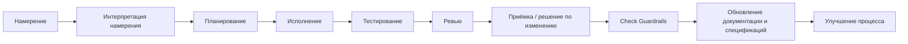
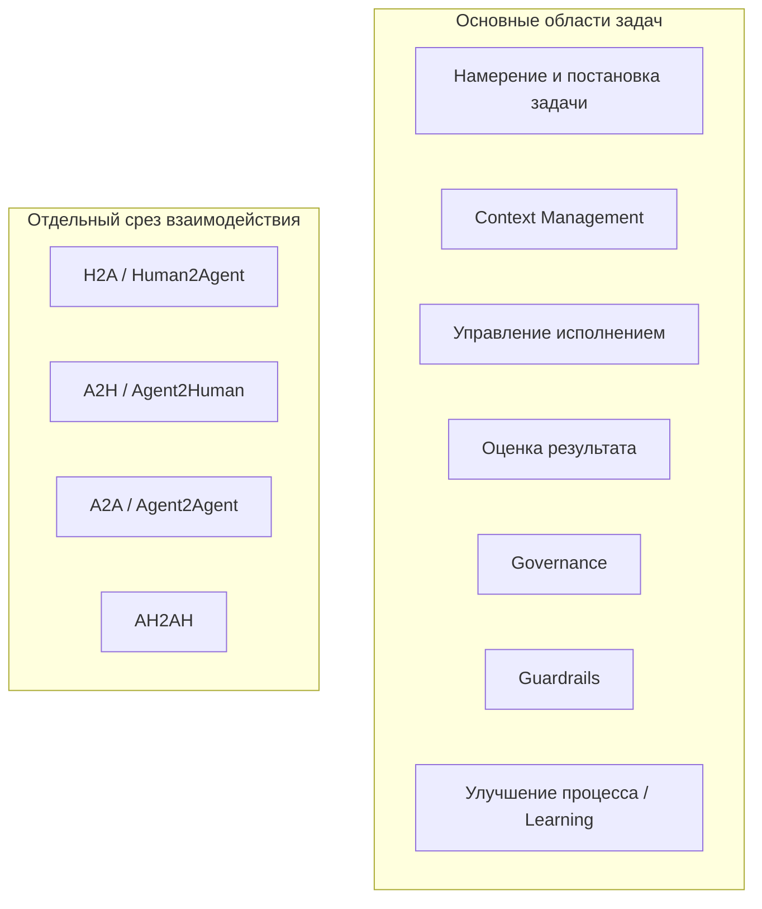

# Каталог компонентов AI-кодинга

> Синтез материалов из `docs/ai-coding-control-model/core` и `docs/ai-coding-control-model/research`.
> Цель: дать одну опорную модель для слайда, детального описания компонентов и общего глоссария.

---

## 1. Назначение документа

Этот файл сводит рабочие материалы в единую компонентную модель AI-кодинга.

Модель описывает не конкретные IDE, агенты или фреймворки, а управляемые области процесса, через которые проходит любое значимое AI-изменение в коде.

---

## 2. Верхнеуровневая карта для слайда

### 2.1. Основные области задач

Это не жизненный цикл, а карта основных областей задач в управляемом AI-кодинге. `Knowledge Freshness` здесь входит в `Context Management`, потому что актуальность знаний - часть управления контекстом и памятью.

По каждой области можно выделять блокеры, простые качественные метрики и сигналы из логов сессий: где агент потерял намерение, взял плохой контекст, неэффективно использовал инструменты, не доказал результат или обошёл ограничения. Без такой разметки непонятно, что именно пошло не так и что улучшать: промпты, контекст, скиллы, проверки, правила или оркестрацию.

Практический приём: регулярно анализировать завершённые AI-сессии и прямо спрашивать агента, что можно было сделать лучше, где он видел лишние итерации, нехватку контекста, слабые проверки или неясную постановку задачи. Ответ должен превращаться не в общие советы, а в конкретные улучшения: новые проверки, шаблоны, промпты, скиллы, правила или подсказки для команды.

| Область задач | Что включает | Вопросы оценки | Концепции / решения |
|---|---|---|---|
| **Намерение и постановка задачи** | намерение, цель, ограничения, что не входит в задачу, критерии приёмки, шаблоны промптов/спецификаций | Понятно ли зачем делаем? Насколько точны и детальны промпты? Есть ли границы и критерии готовности? Можно ли проверить результат? | SDD, OpenSpec, Spec Kit, GigaCode `/insight`, AI Coding Coach |
| **Context Management** | рабочий пакет контекста, долговременная память, память сессии, авторитетность источников, актуальность/рассинхрон между кодом, документацией, спецификациями, контрактами и памятью, статус и приоритет Markdown-артефактов, токен-бюджет, точечный поиск и извлечение, индексы, границы модулей, MCP/RAG | Насколько актуален контекст? Видит ли агент нужные источники? Понятно ли, чему доверять? Есть ли устаревание/рассинхрон? Понятно ли, какая спецификация главнее? Насколько эффективно расходуются токены? Находит ли агент нужное без загрузки лишнего? Помогает ли структура кода экономить контекст? Можно ли восстановить контекст? | Context Engineering, `GIGACODE.md`, DeepWiki, CodeIndexer, MCP/RAG, architecture-as-code, реестр документов/спецификаций, карта источников, пакет контекста, токен-бюджет |
| **Управление исполнением** | план, оркестрация, sandbox/worktree, разрешённые изменения, журнал запуска, журнал отклонений, инструменты, скиллы, субагенты, передача состояния, стратегия мерджа | Насколько исполнение соответствует намерению и границам задачи? Насколько эффективна оркестрация? Правильно ли выбраны инструменты, скиллы и субагенты? Не создаёт ли изменение мердж-конфликтов? Есть ли след действий и отклонений? Можно ли продолжить работу по переданному состоянию? | Codex/GigaCode/Claude Code, SuperPowers, оркестрация инструментов, маршрутизация скиллов, передача состояния субагенту, sandbox/worktree, заголовок операции, журнал запуска, worktree-per-agent, merge queue |
| **Оценка результата** | тесты, CI, компиляция, ревью, доказательства, приёмка, пробелы и остаточный риск | Какие проверки пройдены? Чем подтверждён результат? Закрыты ли критерии приёмки? Запущены ли именно нужные тесты? Можно ли проверить результат быстрее без потери качества? Что осталось непроверенным? | CI, выбор тестов по затронутым областям, инкрементальная компиляция, проверки контрактов/безопасности, маршрутизация ревью, пакет доказательств, контракт утверждение-доказательство |
| **Governance** | роли, владельцы, права, зоны ответственности, правила допуска, матрица согласований | Понятно ли кто владеет областью? Кто может менять артефакт? Где нужен owner review или approval? Кто принимает риск? | CODEOWNERS, owner map, матрица прав, approval rules, branch protection |
| **Guardrails** | риск-гейты, защищённые пути, CODEOWNERS, права, согласования, условия остановки | Сработали ли риск-гейты? Затронуты ли защищённые пути? Нужны ли согласования? Есть ли условия остановки? | CODEOWNERS, защита веток, policy-as-code, защищённые пути, режимы прав |
| **Улучшение процесса / Learning** | GigaCode `/insight`, AI Coding Coach, разбор завершённых сессий, рекомендации агента, фидбэк по проделанной работе, выявление автоматизируемых действий, повторяющиеся сбои, изменения процесса, новые проверки/шаблоны/промпты, создание скиллов, evals, улучшения после ревью | Какие сбои повторяются? Что агент рекомендует улучшить? Где были лишние итерации, слабый контекст или недостаточная проверка? Нужны ли новая проверка, шаблон, промпт, скилл или eval? Подтверждено ли улучшение? | GigaCode `/insight`, AI Coding Coach, скиллы SuperPowers, evals, Promptfoo, Langfuse, изменения процесса |

### 2.2. Отдельный срез: взаимодействие и эффективность

Это не часть карты основных областей задач, а другой срез: как человек и агент взаимодействуют, передают состояние и улучшают постановку задач.

| Канал | Что означает | Что контролируем |
|---|---|---|
| **H2A / Human2Agent** | человек формулирует намерение, задачу, ограничения, контекст и критерии готовности для агента | качество постановки задачи; киберриски входного контекста: секреты, инъекция промпта, небезопасные источники; GigaCode `/insight`, AI Coding Coach, шаблоны промптов/спецификаций |
| **A2H / Agent2Human** | агент задаёт вопросы, ставит задачи человеку, сообщает статус, объясняет план/изменения, эскалирует риск и передаёт итог | правовые риски и ответственность: кто принял решение, кто дал согласование, что зафиксировано в аудиторском следе |
| **A2A / Agent2Agent** | один агент передаёт другому контекст, задачу, доказательства или выводы ревью | киберриски передачи: отравление контекста, утечка данных, расширение прав, доверие к передаче состояния |
| **AH2AH / Agent+Human to Agent+Human** | связка человек+агент передаёт работу другой связке человек+агент | межкомандная передача, владение, границы ответственности, аудиторский след |

### 2.3. Упрощённый flow выполнения

```text
Намерение
  -> Интерпретация намерения
  -> Планирование
  -> Исполнение
  -> Тестирование
  -> Ревью
  -> Приёмка / решение по изменению
  -> Check Guardrails
  -> Обновление документации и спецификаций
  -> Улучшение процесса

Guardrails в целом ограничивают исполнение, проверки и принятие результата.
H2A, A2H, A2A и AH2AH - отдельный срез взаимодействия, а не этап жизненного цикла.
```

Расшифровка:

| Этап | Смысл |
|---|---|
| **Намерение** | человек формулирует проблему, цель, ограничения и ожидаемый результат |
| **Интерпретация намерения** | агент уточняет смысл, собирает контекст и превращает запрос в проверяемую задачу |
| **Планирование** | фиксируются шаги, границы изменения, риски, проверки и условия остановки |
| **Исполнение** | агент меняет код и связанные артефакты в рамках согласованного плана |
| **Тестирование** | результат проверяется тестами, проверками контрактов/безопасности и доказательствами |
| **Ревью** | человек/агент проверяет изменения, доказательства, допущения и остаточные риски |
| **Приёмка / решение по изменению** | изменение принимается, возвращается на доработку или фиксируется пробел |
| **Check Guardrails** | проверяется, что соблюдены риск-гейты, защищённые пути, согласования, обязательные проверки и условия остановки |
| **Обновление документации и спецификаций** | документация, спецификации, контракты и память приводятся в соответствие с принятым изменением |
| **Улучшение процесса** | повторяющиеся сбои превращаются в новые проверки, шаблоны, промпты, скиллы или правила |

### 2.4. Диаграмма этапов



### 2.5. Диаграмма основных областей задач AI-кодинга



---

## 3. Идеи и инсайты

### 3.1. Инсайт: модель должна зависеть от концепций, а не от фреймворка

AI-кодинг не должен быть жёстко привязан к одному фреймворку или инструменту.

Сегодня команда использует OpenSpec, завтра другой spec framework, послезавтра меняет агентную IDE или CI-подход. Но базовые проблемы остаются теми же: намерение надо уточнить, контекст найти, риск оценить, изменение выполнить, результат проверить, знания обновить, ответственность зафиксировать.

Поэтому компоненты модели должны описывать не конкретный tool stack, а устойчивые концепции:

- намерение и критерии готовности;
- контекст, память и авторитетность источников;
- риск, права и Guardrails;
- план, исполнение и след действий;
- проверки, доказательства и приёмка;
- актуальность документов и спецификаций;
- обучение процесса по итогам сессий.

### 3.2. Инсайт: Vibe Coding и SDD как управляемый спектр

Модель не утверждает, что любая задача должна проходить через тяжёлый specification-driven процесс.

Практически команда всегда балансирует между двумя режимами:

| Режим | Когда уместен | Что обязательно даже в лёгком режиме | Главный риск |
|---|---|---|---|
| **Vibe Coding** | низкий риск, локальное изменение, быстрый exploration, прототип, черновик | понятный intent, ограниченный scope, короткая проверка, честное “что не проверено” | быстрый код принимается за готовый engineering result |
| **SDD / Specification-Driven Development** | medium/high risk, контракт, публичный API, данные, безопасность, миграции, много владельцев | spec, acceptance criteria, impact/risk, plan, доказательства, freshness decision | процесс становится слишком тяжёлым и команда его обходит |

Ключевая идея:

```text
Vibe Coding и SDD - не враги.
Это два конца спектра контроля.

Задача участников команды - выбрать правильную глубину спецификации,
планирования, проверки и доказательств под риск конкретного изменения.
```

Практическая формула:

```text
Low risk:
  intent + small scope + local check + короткая фиксация доказательств.

Medium risk:
  change spec + acceptance criteria + plan + impact note + verification report.

High/Critical risk:
  reviewed spec + owner approval + risk gates + contract/security checks
  + пакет доказательств + freshness/reconciliation decision.
```

Это важно для презентации: зрелость AI-кодинга не в том, чтобы запретить быстрый режим, а в том, чтобы не применять быстрый режим там, где нужен управляемый engineering-процесс.

### 3.3. Идея: разбирайте завершённые сессии

После значимой AI-сессии полезно попросить агента сделать короткий разбор:

- что можно было сделать лучше;
- где постановка задачи, контекст, план или проверки были слабыми;
- какие проверки, шаблоны, промпты, скиллы или правила он рекомендует добавить.

Так сессия становится источником улучшений, а не просто разовым выполнением задачи.

### 3.4. Инсайт: контекстное окно всегда будет меньше проекта

Кода, документации и Markdown-файлов будет становиться больше, а контекстное окно агента всё равно останется ограничением.

Отсюда отдельная инженерная задача: не просто «дать агенту контекст», а помочь ему быстро найти нужную информацию и не потратить токены на шум.

Практический фокус:

- индексы по коду и документации;
- карты источников и владельцев;
- точечный поиск вместо загрузки больших файлов целиком;
- короткие выжимки контекста со ссылками на первоисточники;
- сжатие истории сессии до фактов, решений и открытых вопросов;
- контроль токен-бюджета как часть качества AI-сессии.

### 3.5. Инсайт: узкое место смещается в интеграцию и проверку

AI ускоряет написание кода, но не отменяет стоимость встраивания изменения в систему.

Рост кодовой базы почти всегда тянет за собой рост тестов, сборок, зависимостей, сложностей с ревью и конфликтов merge. Поэтому ключевой вопрос уже не только “может ли агент написать diff?”, а “может ли команда быстро и доказательно принять этот diff?”.

Нужны практики:

- выбирать проверки по затронутым областям и риску;
- запускать сначала быстрые проверки по изменённой части, а долгие проверки выносить в CI или параллельный запуск;
- до реализации понимать зону влияния изменения: какие модули и контракты затронуты, какие проверки нужны и кто должен ревьюить;
- направлять ревью к владельцам затронутых контрактов, модулей и рисков;
- разделять быстрые локальные проверки, обязательные gate-проверки и финальную приёмку;
- фиксировать, что не проверялось и какой риск остаётся.

### 3.6. Инсайт: код тоже должен стать удобным для контекста

Если агенту нужно держать в голове всё изменение, то структура кода начинает напрямую влиять на качество AI-кодинга.

Возможно, нам придётся иначе оформлять код: делать модули меньше, границы явнее, зависимости прозрачнее, а входные точки и контракты легче находимыми. Не потому что “так красивее”, а потому что иначе нужный кусок системы не помещается в контекст или требует слишком много токенов.

То, что раньше могло казаться излишеством, становится рабочей необходимостью:

- детальная документация кода и модулей;
- явные ADR и архитектурные решения;
- карты зависимостей и владельцев;
- архитектура системы рядом с кодом;
- architecture-as-code для схем, контрактов, диаграмм и правил;
- тщательное планирование архитектуры до реализации.

### 3.7. Инсайт: Markdown-артефактам нужен жизненный цикл

Большое количество спецификаций, ADR, runbooks и Markdown-документов создаёт новую проблему: агенту мало найти документ, нужно понять его статус, актуальность и приоритет.

Иначе старый черновик, локальная заметка или устаревшая спецификация будут выглядеть для агента так же убедительно, как актуальный источник истины.

Нужны практики управления такими артефактами:

- реестр спецификаций и документов;
- статус: draft, active, accepted, superseded, archived;
- владелец и область ответственности;
- приоритет источников при конфликте;
- правила обновления после изменения кода;
- отметки актуальности и причины устаревания;
- явное архивирование или промоция временных документов.

---

## 4. Детальное описание областей управления

Этот раздел детализирует не конкретные фреймворки, а устойчивые области управления AI-кодингом. OpenSpec, Spec Kit, Codex, GigaCode, Claude Code, CI/CD, RAG или MCP могут меняться; остаются задачи управления намерением, контекстом, правами, риском, исполнением, проверкой, знаниями и улучшением процесса.

`Knowledge Freshness` здесь рассматривается как детализация `Context Management`: актуальность знаний, статус Markdown-артефактов и приоритет источников нужны для правильного выбора контекста. `H2A`, `A2H`, `A2A` и `AH2AH` вынесены в отдельный срез взаимодействия, а не смешиваются с lifecycle выполнения.

### 4.1. Governance

**Определение:** задание правил, ролей, владельцев, прав и зон ответственности, в рамках которых агент может читать, менять, проверять и передавать результаты.

**Проблема, которую решает:** агент может действовать быстро, но без явных правил он не знает, какие источники авторитетны, какие файлы защищены, где нужен approval, какие проверки обязательны и когда временная заметка может стать знанием проекта.

Governance задаёт правила и владельцев. Guardrails применяют эти правила к конкретному изменению: ограничивают исполнение, проверки и принятие результата.

**Что входит:**

- модель авторитетности источников;
- реестр артефактов проекта;
- матрица операций агента;
- права записи и защищённые пути;
- approval rules;
- risk-based gates;
- политика доказательств;
- жизненный цикл артефактов;
- audit requirements;
- правила работы с памятью и сгенерированными выжимками.

**Типовые артефакты:**

- `artifact-registry.md`;
- `operation-matrix.md`;
- `source-authority.md`;
- `write-permissions.md`;
- `protected-paths.yaml`;
- `proof-policy.md`;
- `freshness-rules.md`;
- `approval-rules.yaml`;
- `audit-log`.

**Ключевые вопросы:**

- Какой это тип артефакта?
- Кто владелец?
- Это источник истины, подсказка, доказательства или generated cache?
- Можно ли агенту это менять напрямую?
- Какая проверка обязательна перед завершением?
- Когда артефакт устаревает?
- Что делать при конфликте источников?

**Типовые сбои:**

- search result воспринимается как истина;
- агент молча переписывает ADR или trusted memory;
- run log становится “памятью проекта” без review;
- нет владельца знания;
- approval нужен, но gate отсутствует;
- одинаковая глубина контроля применяется к typo и к изменению auth.

**Практики улучшения:**

- ввести authority levels;
- разделить knowledge, work, доказательства и derived artifacts;
- задать operation header перед значимой задачей;
- использовать risk-based control budget;
- хранить доказательства отдельно от итогового текста агента;
- делать policies machine-readable там, где это возможно.

**Примеры адаптеров (replaceable):**

- `AGENTS.md`, `CLAUDE.md`, `GIGACODE.md`;
- GitHub branch protection и CODEOWNERS;
- GitHub Actions, policy checks;
- Claude/Codex permission modes;
- protected paths;
- Audit Logger;
- Policy Engine;
- internal developer platform.

---

### 4.2. Context Management

**Определение:** управление тем, что агент видит, откуда извлекает знания, чему доверяет и как экономит ограниченное контекстное окно.

**Короткая формула:**

```text
Контекст = выбранные данные + решения сессии + след действий.
Истина = авторитетный источник + актуальность + доказательства.
```

**Проблема, которую решает:** кода, тестов, спецификаций и Markdown-документов становится всё больше, а контекстное окно ограничено. Агент либо не видит важный источник, либо перегружает окно шумом, либо принимает устаревшую выжимку за правду.

Внутри этой области находится и `Knowledge Freshness`: контроль актуальности, статуса и приоритета знаний до, во время и после изменения.

**Что входит:**

- context engineering;
- extraction и retrieval;
- навигация от карты проекта к конкретным файлам;
- индексы по коду и документации;
- архитектурные карты и границы модулей;
- маршруты поиска от вопроса к источнику;
- context pack;
- context compression и compaction;
- just-in-time context;
- управление context window и token budget;
- project memory;
- agent memory;
- session memory;
- authority metadata;
- freshness metadata;
- конфликт источников.

**Типовые входы:**

- запрос пользователя;
- инструкции и repo rules;
- код, тесты, конфиги;
- specs, ADR, docs, contracts;
- MCP-источники: Jira, Confluence, Notion, logs;
- результаты команд;
- текущий diff;
- решения и допущения сессии.

**Типовые артефакты:**

- `context-pack.md`;
- `retrieval-report.md`;
- `source-map.md`;
- `authority-matrix.md`;
- `session-notes.md`;
- `handoff-summary.md`;
- `source-citations`;
- generated repo map или index.

**Ключевые вопросы:**

- Что нужно знать для решения?
- Где это может лежать?
- Какой источник сильнее при конфликте?
- Что могло устареть?
- Что не стоит класть в окно целиком?
- Как найти нужное без загрузки лишнего?
- Понятны ли границы модулей, входные точки и зависимости?
- Где расходуются токены впустую?
- Какие решения сессии являются временными?
- Чем summary подтверждается?

**Типовые сбои:**

- Context Selection Failure: агент не нашёл нужные tests/specs/contracts;
- Knowledge Authority Ambiguity: README, код и ADR противоречат друг другу;
- Context rot: окно деградирует из-за шума, старых решений и перегруза;
- Context poisoning: ошибка попала в persistent context и размножается в будущих задачах;
- generated context pack воспринимается как source of truth;
- весь репозиторий грузится вместо точечного маршрута;
- большой модуль или файл требует загрузить слишком много контекста;
- архитектурное решение есть только в головах людей или старом чате.

**Практики улучшения:**

- начинать с карты, а не с чтения всего подряд;
- хранить route поиска отдельно от найденной истины;
- использовать индексы, карты источников и точечный поиск;
- держать архитектурные решения, карты модулей и владельцев рядом с кодом;
- проектировать модули так, чтобы их можно было понимать и менять без загрузки половины системы;
- помечать authority и freshness;
- делать context compaction с сохранением фактов, решений и открытых вопросов;
- держать активное состояние задачи коротким;
- подгружать just-in-time context;
- контролировать токен-бюджет как показатель качества сессии;
- разделять “retrieved candidate” и “accepted fact”.

**Примеры адаптеров (replaceable):**

- `rg`, code search, CodeIndexer;
- RAG по коду;
- DeepWiki или repo map;
- MCP;
- AGENTS.md и skills;
- vector index;
- context sanitizer;
- token budget dashboard.

---

### 4.3. Намерение и постановка задачи / SDD

**Определение:** превращение человеческого запроса в проверяемую задачу: intent, цель, ограничения, что не входит в задачу, ожидаемое поведение и критерии приёмки.

**Проблема, которую решает:** намерение остаётся в чате, контекст распадается, агент начинает реализацию по приблизительному пониманию, scope расползается, а результат невозможно принять объективно.

SDD здесь не “документ ради документа”, а способ стабилизировать контекст. Если бы агент всегда идеально удерживал намерение, ограничения, историю решений и критерии проверки, потребность в specs была бы намного ниже.

**Что входит:**

- intent capture;
- clarification questions;
- scope и non-goals;
- expected behavior;
- affected surfaces;
- constraints;
- assumptions;
- open questions;
- acceptance criteria;
- verification plan seed;
- conversation-to-contract gate.

**Типовые артефакты:**

- `intent.md`;
- `change-spec.md`;
- `requirements.md`;
- `design.md`;
- `acceptance.md`;
- `open-questions.md`;
- OpenSpec change;
- GitHub issue template;
- Spec Kit artifacts.

**Ключевые вопросы:**

- Какую проблему человек хочет решить?
- Что должно измениться в поведении?
- Что точно не входит в задачу?
- Какие ограничения нельзя нарушить?
- Как проверить готовность?
- Какие вопросы нельзя угадать без человека?

**Типовые сбои:**

- Intent Loss: смысл остался только в переписке;
- Scope Ambiguity: агент делает больше или иначе, чем ожидалось;
- Premature Implementation: код пишется до критериев готовности;
- acceptance criteria формальны и не проверяют реальное ожидание;
- change spec после merge не архивируется и не промотируется в stable knowledge.

**Практики улучшения:**

- правило “нет нетривиальной реализации без intent и acceptance criteria”;
- различать lightweight intent для Vibe Coding и formal change spec для SDD;
- шаблоны change spec по уровню риска;
- explicit non-goals;
- examples и edge cases;
- связывать каждый acceptance criterion с будущей проверкой;
- отделять stable spec от proposed change.

**Примеры адаптеров (replaceable):**

- OpenSpec;
- GitHub Spec Kit;
- Kiro Specs;
- issue templates;
- product requirement templates;
- acceptance checklist;
- BDD/Gherkin там, где полезно.

---

### 4.4. Guardrails

**Определение:** ограничения и обязательные проверки, которые переводят риск конкретного изменения в правила исполнения, ревью и принятия результата.

**Проблема, которую решает:** агент меняет локальный файл, но не видит API, контракты, схемы данных, границы безопасности, downstream consumers и владельцев. Без Guardrails риск остаётся абстрактной оценкой и не превращается в конкретные действия.

**Что входит:**

- оценка зоны влияния изменения;
- затронутые модули, API, контракты и схемы;
- миграции и обратная совместимость;
- киберриски, privacy и защищённые области;
- владельцы и обязательные согласования;
- риск-гейты и условия остановки;
- обязательные проверки по типу изменения;
- план отката;
- release/runtime risk.

**Типовые артефакты:**

- `impact-report.md`;
- `affected-areas.md`;
- `risk-note.md`;
- `owner-map.md`;
- `dependency-map.md`;
- `test-selection.md`;
- `approval-record.md`;
- `rollback-plan.md`.

**Ключевые вопросы:**

- Какие модули, API и контракты затронуты?
- Кто владеет этими областями?
- Какова цена ошибки?
- Какие проверки обязательны для этого риска?
- Нужны ли design review, security review или contract review?
- Можно ли агенту исполнять задачу автономно?

**Режимы контроля по риску:**

| Риск | Типичный режим | Автономность агента | Контроль человека | Минимальные доказательства |
|---|---|---|---|---|
| Low | Vibe Coding с границами | высокая | ревью после изменения | краткое описание diff, локальная проверка или объяснение |
| Medium | облегчённый SDD | умеренная | согласование плана перед реализацией | критерии приёмки, impact note, тесты, список изменённых файлов |
| High | SDD с owner gates | низкая | согласование спецификации и плана | CI, проверки контрактов/безопасности, owner review |
| Critical | human-led, agent-assisted | очень низкая | решения ведёт человек | formal review, аудиторский след, план отката |

**Решение Guardrails:**

Guardrails должны выдавать не только оценку риска, но и обязательное решение для исполнения.

| Поле | Что фиксирует |
|---|---|
| `risk_level` | low, medium, high, critical |
| `work_mode` | Vibe Coding with boundaries, lightweight SDD, SDD with owner gates, human-led |
| `allowed_writes` | какие области можно менять без дополнительного согласования |
| `required_approvals` | кто должен согласовать spec, plan, protected paths или release |
| `required_checks` | тесты, CI, контракты, безопасность, миграции, docs/freshness |
| `proof_minimum` | минимальный набор доказательств для завершения |
| `reconciliation_triggers` | какие docs/specs/contracts/memory надо проверить после diff |

**Типовые сбои:**

- Impact Blindness: не найдена зависимость, которую ломает изменение;
- OpenAPI или schema не обновлены;
- не подключён владелец;
- проверка не соответствует риску;
- агент обходит approval через “маленький” diff;
- security-sensitive change проверяется как обычный refactor;
- Vibe Coding применяется к задаче, где нужен SDD;
- SDD применяется к простой задаче и создаёт лишний overhead.

**Практики улучшения:**

- risk tags для задач;
- protected areas;
- CODEOWNERS и карта владельцев;
- проверки route/API/schema diff;
- deterministic-first сигналы по impact и freshness;
- чеклисты по типам изменений.

**Примеры адаптеров (replaceable):**

- CODEOWNERS;
- dependency graph;
- OpenAPI diff;
- schema diff;
- security scanners;
- threat model templates;
- PR labels and required reviewers;
- policy-as-code.

---

### 4.5. Управление исполнением / Orchestration

**Определение:** управление тем, как агент выполняет работу: план, фазы, инструменты, sandbox/worktree, права, журналы действий, отклонения, скиллы, субагенты и передача состояния.

**Проблема, которую решает:** “агент пишет код” без фаз, границ и следа работы. В итоге непонятно, почему он сделал изменение, какие команды запускал, где отклонился от плана, какие инструменты выбрал и можно ли продолжать сессию.

**Что входит:**

- объявление режима работы;
- фазы: уточнение, поиск контекста, анализ, планирование, реализация, проверка, приёмка, обновление знаний, handoff;
- план и контрольные точки;
- стратегия мерджа и разбиения изменения;
- права и согласования;
- границы sandbox/worktree/container;
- разрешённые инструменты;
- журнал команд;
- журнал решений;
- журнал отклонений;
- список изменённых файлов;
- условия остановки;
- handoff summary.

**Типовые артефакты:**

- `operation-header.yaml`;
- `execution-plan.md`;
- `plan-approval.md`;
- `run-log.md`;
- `commands-run.md`;
- `decision-trace.md`;
- `deviation-log.md`;
- `changed-files.md`;
- `merge-plan.md`;
- `handoff-summary.md`.

**Ключевые вопросы:**

- Какая операция сейчас выполняется?
- Какие артефакты задействованы?
- Есть ли checkpoint плана перед реализацией?
- Что агенту разрешено читать и менять?
- Какие действия требуют согласования?
- Как изменение будет безопасно влито без лишних конфликтов?
- Какой результат должен появиться?
- Как фиксируются отклонения?
- Что должно остановить исполнение?

**Пример operation header:**

```yaml
operation:
  mode: impact-analysis
  target_artifacts:
    - changes/add-refresh-token-auth/
    - contracts/openapi.yaml
    - specs/current/auth.md
  allowed_actions:
    - read
    - search
    - create impact report
  forbidden_actions:
    - edit production code
    - rewrite stable specs
  outputs:
    - changes/add-refresh-token-auth/affected-areas.md
    - changes/add-refresh-token-auth/verification-plan.md
```

**Типовые сбои:**

- Execution Drift: агент уходит в соседний refactor;
- зацикливание и лишние действия;
- изменение посторонних файлов;
- ослабление тестов ради прохождения;
- нет журнала запуска;
- следующий агент не может восстановить состояние;
- agent mode выбран неправильно и gate это не ловит.

**Практики улучшения:**

- явно выделять `plan` как отдельную операцию, а не как комментарий перед кодом;
- контрольные точки по фазам;
- условия остановки;
- разрешённые и запрещённые пути;
- worktree-per-agent;
- согласование плана для medium/high risk до перехода к реализации;
- делить большие изменения на части с понятной стратегией мерджа;
- заранее проверять пересечения с защищёнными областями и активными изменениями;
- использовать merge queue или аналог там, где много параллельных AI-изменений;
- классификация отклонений: ожидаемое, безвредное, требует согласования, требует отката;
- reusable recipes для типовых задач.

**Plan checkpoint:**

```text
Plan фиксирует порядок действий, границы записи, обязательные проверки,
ожидаемые результаты, условия остановки и путь сбора доказательств.

Для medium/high risk задач переход к реализации без plan запрещён.
Для low risk задач plan может быть коротким: scope + files + local check.
```

**Примеры адаптеров (replaceable):**

- Codex;
- Claude Code;
- GigaCode;
- GitHub Copilot coding agent;
- Jules;
- Superpowers;
- GSD/GStack;
- CI harness;
- browser/test harnesses;
- containerized dev environments.

---

### 4.6. Оценка результата / Проверка и доказательства

**Определение:** проверка результата относительно критериев готовности и сбор доказательств, по которым человек или команда могут принять изменение.

**Проблема, которую решает:** агент говорит “готово” или “тесты прошли”, но непонятно, что именно проверялось, какие критерии закрыты, какие риски остались и можно ли принять результат.

**Что входит:**

- план проверки;
- выбор проверок по затронутым областям;
- unit, integration, e2e and smoke tests;
- typecheck and lint;
- инкрементальная компиляция;
- кеши и параллельные проверки;
- проверки контрактов;
- проверки безопасности;
- проверки миграций;
- ручная проверка;
- результат CI;
- скриншоты и логи;
- чеклист приёмки;
- заметки ревью;
- пакет доказательств;
- известные пробелы.

**Типовые артефакты:**

- `verification-report.md`;
- `proof-bundle.md`;
- `check-plan.md`;
- `test-selection.md`;
- `test-results.md`;
- `compile-report.md`;
- `ci-link`;
- `contract-check-report.md`;
- `security-check-report.md`;
- `review-routing.md`;
- `review-notes.md`;
- `screenshots`;
- `known-gaps.md`.

**Формула готовности:**

```text
Готово =
критерии готовности закрыты
+ доказательства приложены
+ известные пробелы названы.
```

**Контракт утверждение-доказательство:**

Каждое финальное утверждение агента должно быть подкреплено доказательствами или явно помечено как непроверенное.

| Утверждение | Нужные доказательства |
|---|---|
| “Критерий приёмки выполнен” | id критерия, ссылка на diff/код, команда или проверка, результат |
| “Тесты прошли” | команда, окружение, timestamp или ссылка на CI, результат |
| “Контракт не сломан” | результат проверки контракта |
| “Документация актуальна” | решение по актуальности: updated или not affected |
| “Не проверено” | явный пробел, причина, остаточный риск |

**Ключевые вопросы:**

- Какие критерии приёмки проверены?
- Какими командами и результатами это подтверждено?
- Что проверялось автоматически, а что вручную?
- Почему выбран именно этот набор тестов?
- Можно ли ускорить проверку через инкрементальную компиляцию, кеши или параллельный запуск?
- Какие контракты и границы безопасности затронуты?
- Кто должен ревьюить изменение по затронутым областям?
- Какие проверки не запускались и почему?
- Какие остаточные риски остаются?

**Типовые сбои:**

- Verification Shallowness: один test pass заменяет полную проверку;
- пробел доказательств: нет команд, логов, diff summary или ссылки на CI;
- проверка не связана с критериями приёмки;
- контракт сломан, но unit tests green;
- docs/specs устарели, но задача помечена complete;
- запущен слишком узкий набор тестов;
- запущено слишком много проверок без связи с риском и изменением;
- мердж-конфликт найден только в конце работы;
- ревью попало не к владельцу области;
- LLM-as-judge используется как единственная проверка.

**Практики улучшения:**

- политика доказательств;
- сводка утверждений и доказательств;
- связка критериев готовности с тестами;
- выбор тестов по затронутым областям;
- инкрементальная компиляция и кеширование;
- параллельный запуск долгих проверок;
- маршрутизация ревью по владельцам и CODEOWNERS;
- обязательные проверки по риску;
- сохранять исходные выводы команд или ссылки;
- явно писать “не проверено”;
- использовать evals для повторяемых агентных задач.

**Примеры адаптеров (replaceable):**

- CI/CD;
- pytest, npm test, cargo test и другие локальные runners;
- static analysis;
- contract testing;
- security scanners;
- SWE-bench-like evals;
- Promptfoo/Langfuse для prompt/workflow evals;
- PR review assistants.

---

### 4.7. Актуальность знаний и жизненный цикл документов

**Определение:** детализация `Context Management`: контроль рассинхрона между кодом, документацией, specs, contracts, ADR, generated summaries и persistent memory после изменения, включая статус, актуальность и приоритет Markdown-артефактов.

**Проблема, которую решает:** код изменился, а проектные знания остались прежними. При большом количестве specs и Markdown-документов агенту трудно понять, какой документ актуален, какой является черновиком, какой устарел и какой источник главнее при конфликте. Для AI-агента устаревший уверенный Markdown опаснее, чем отсутствие Markdown.

**Что входит:**

- freshness checks;
- documentation drift;
- specification rot;
- code-doc drift;
- spec-code-test drift;
- contract reconciliation;
- ADR update proposal;
- stable spec promotion;
- статус и приоритет для specs/docs;
- жизненный цикл документов и спецификаций;
- stale generated context invalidation;
- memory lifecycle.

**Типовые артефакты:**

- `freshness-report.md`;
- `stale-facts.yaml`;
- `doc-update-proposal.md`;
- `contract-update.md`;
- `adr-update-proposal.md`;
- `doc-registry.md`;
- `spec-registry.md`;
- `source-priority.md`;
- `reconciliation-checklist.md`;
- `archive-note.md`.

**Ключевые вопросы:**

- Какие знания стали неактуальными после diff?
- Нужно ли обновить docs, specs, contracts, ADR или runbooks?
- Какой статус у документа: draft, active, accepted, superseded или archived?
- Какой источник приоритетнее при конфликте?
- Что должно быть архивировано?
- Какие сгенерированные выжимки контекста больше нельзя использовать?
- Какие выводы сессии можно перенести в память проекта?
- Кто должен проверить обновление?

**Типовые сбои:**

- Knowledge Drift: docs/specs/contracts расходятся с кодом;
- change spec принимается за stable spec;
- черновик воспринимается как принятое решение;
- две спецификации противоречат друг другу, но приоритет не задан;
- ADR переписан задним числом без review;
- old summaries попадают в будущий context;
- freshness определяется только LLM-оценкой без deterministic signals.

**Практики улучшения:**

- deterministic-first drift signals: changed paths, schema diff, contract diff, CODEOWNERS;
- explicit freshness triggers в artifact registry;
- реестр документов и спецификаций со статусом, владельцем и приоритетом;
- lifecycle для change artifacts после merge;
- явные правила промоции draft -> accepted и архивирования superseded docs;
- generated indexes регенерировать, а не редактировать руками;
- promotion только через review;
- stale summary invalidation.

**Примеры адаптеров (replaceable):**

- OpenAPI diff;
- schema validation;
- docs lint;
- contract tests;
- CODEOWNERS;
- generated repo maps;
- knowledge base updater;
- release note generation with review.

---

### 4.8. Отдельный срез: H2A / A2H / A2A / AH2AH

**Определение:** коммуникационная и контрольная плоскость AI-кодинга: человек-агент, агент-человек, агент-агент и передача между связками человек+агент.

Это не этап lifecycle и не отдельная область исполнения. Это срез, который показывает, как намерение, статус, решения, риски и доказательства переходят между участниками работы.

| Канал | Что означает | Типовые ситуации |
|---|---|---|
| **H2A / Human2Agent** | человек формулирует намерение, ограничения, контекст и критерии готовности | постановка задачи, уточнение scope, передача контекста, выбор режима работы |
| **A2H / Agent2Human** | агент объясняет, спрашивает, ставит задачи человеку, эскалирует и передаёт состояние | уточнение, approval, задача на ревью, запрос доступа, запрос решения, финальная сводка |
| **A2A / Agent2Agent** | один агент передаёт состояние, доказательства или задачу другому агенту | handoff, параллельное ревью, специализированный субагент |
| **AH2AH / Agent+Human to Agent+Human** | одна связка человек+агент передаёт работу другой связке | команда-команда, role handoff, cross-owner review |

**Доминирующие риски по каналам:**

| Канал | Основной риск | Что контролировать |
|---|---|---|
| **H2A** | киберриски входного контекста | секреты, инъекция промпта, небезопасные источники, избыточный контекст |
| **A2H** | правовые риски и ответственность | кто принял решение, что агент поручил человеку, где approval, что попало в аудиторский след |
| **A2A** | киберриски передачи между агентами | отравление контекста, утечка данных, расширение прав, доверие к handoff |
| **AH2AH** | риск потери владения при передаче между связками | границы ответственности, межкомандный handoff, аудиторский след |

**Проблема, которую решает:** агент выполняет работу как чёрный ящик. Человек видит только diff или финальное “готово” и не может вовремя остановить scope drift, проверить assumptions или принять риск.

**Что входит:**

- уточнение намерения;
- статусы выполнения;
- задачи человеку: ревью, согласование, запрос доступа, запрос решения;
- объяснение использованного контекста;
- объяснение плана;
- допущения;
- вопросы и эскалации;
- запросы согласования;
- объяснение компромиссов;
- объяснение diff;
- объяснение проверок;
- финальная сводка;
- handoff человеку или следующему агенту.

**Типовые артефакты:**

- `question.md`;
- `status-update`;
- `approval-request.md`;
- `decision-rationale.md`;
- `handoff-summary.md`;
- PR summary;
- review comments;
- финальная сводка утверждений и доказательств.

**Ключевые вопросы:**

- Что агент понял?
- Какие допущения он принял?
- Где он не уверен?
- Что он собирается менять?
- Какие решения требуют человека?
- Что изменилось относительно плана?
- Как человеку быстро проверить результат?

**Типовые сбои:**

- человек узнаёт о риске только в конце;
- агент не спрашивает, когда надо;
- финальная сводка не связана с критериями приёмки;
- diff непонятен ревьюеру;
- handoff не позволяет продолжить работу;
- человек превращается в пассивного наблюдателя вместо владельца намерения и риска.

**Практики улучшения:**

- короткие, но регулярные статусы;
- явные допущения;
- запросы согласования, привязанные к Governance и Guardrails;
- протокол handoff;
- явное различение: “сделано”, “проверено”, “не проверено”;
- review-ready summaries;
- правила эскалации.

**Примеры адаптеров (replaceable):**

- Codex/GigaCode/Claude Code chat;
- PR summaries;
- issue comments;
- review assistants;
- session handoff protocol;
- IDE notifications;
- AI Engineer Coach.

---

### 4.9. Улучшение процесса / Learning

**Определение:** контур улучшения процесса, который превращает доказательства, findings ревью, повторяющиеся сбои и evals в проверенные изменения правил, навыков, шаблонов, промптов, скиллов и инструментов.

**Проблема, которую решает:** агент повторяет одни и те же ошибки, но процесс не учится. При этом “скорость генерации кода” ошибочно принимается за реальную эффективность.

**Что входит:**

- разбор завершённых AI-сессий;
- таксономия повторяющихся сбоев;
- GigaCode `/insight`;
- eval-driven development;
- capability evals;
- regression evals;
- prompt/workflow evals;
- улучшение шаблонов;
- предложения новых проверок;
- предложения новых или обновлённых скиллов;
- жизненный цикл инструментов;
- метрики эффективности связки человек-агент;
- экономика токенов.

**Типовые артефакты:**

- `retrospective.md`;
- `process-patch.md`;
- `insight.md`;
- `eval-fixture`;
- `eval-report.md`;
- `recipe-update-proposal.md`;
- `new-gate-proposal.md`;
- `productivity-notes.md`;
- metrics dashboard.

**Ключевые вопросы:**

- Какие ошибки повторяются?
- Какая проверка предотвратила бы ошибку?
- Какой шаблон уменьшит усилие на ревью?
- Улучшение подтверждено доказательствами или только ощущением?
- Насколько точно человек формулирует намерение, задачу, ограничения и критерии приёмки для агента?
- Стал ли человек быстрее и спокойнее принимать результат?
- Снизились ли доработки, когнитивная нагрузка и частота вмешательства человека?

**Human2Agent Effectiveness:**

Это отдельный фокус внутри эффективности: не “насколько агент умный”, а насколько хорошо человек управляет агентом через intent, постановку задачи, ограничения и критерии готовности.

| Что измеряем | Типичный сигнал | Как улучшаем |
|---|---|---|
| Точность intent | агент переспрашивает, уходит не туда, меняет лишнее | шаблон intent, examples, non-goals |
| Качество постановки задачи | нет scope, constraints, affected surfaces | AI Coding Coach, IDE extension, checklist |
| Проверяемость задачи | нет критериев приёмки или они формальные | acceptance checklist, spec review |
| Цена коммуникации | много уточнений, долгий review, rework | GigaCode `/insight`, reusable prompts, better handoff |

**Поток улучшения процесса:**

```text
Observation -> Insight -> Proposal -> Review -> Accepted change
```

| Step | Смысл | Output |
|---|---|---|
| Observation | найден повторяющийся сбой, friction или gap | raw note, review finding, incident |
| Insight | сформулирована причина и pattern | `insight.md` |
| Proposal | предложено изменение процесса, шаблона, проверки, скилла или eval | `process-patch.md` |
| Review | владелец процесса принимает или отклоняет proposal | decision record |
| Accepted change | обновлён control artifact, шаблон, проверка или eval | reviewed policy/template/check |

**Модель измерения:**

Метрика не является улучшением сама по себе. Для каждой метрики нужны владелец, периодичность, способ расчёта и решение, которое эта метрика поддерживает.

| Область метрик | Пример метрики | Какое решение поддерживает |
|---|---|---|
| Качество работы агента | first-pass correctness, полнота доказательств | какие recipes/checks улучшать |
| Усилие человека | review effort, cognitive load | где агент добавляет overhead |
| Поток поставки | time from intent to verified change, rework rate | где процесс тормозит |
| Стоимость контроля | human intervention rate, approval wait time | где контроль чрезмерен или слаб |
| Качество знаний | docs/spec freshness after change | где нужен freshness gate |

**Метрики агента:**

- intent understanding accuracy;
- context quality;
- token budget discipline;
- first-pass correctness;
- rework rate;
- verification quality;
- полнота доказательств;
- explanation quality;
- time and command cost.

**Метрики системы человек-агент:**

- time from intent to verified change;
- review effort;
- cognitive load;
- human intervention rate;
- specification compliance rate;
- доверие, откалиброванное доказательствами;
- lead time;
- defect escape rate;
- docs/spec freshness after change.

**Типовые сбои:**

- Process Non-Learning: повторяющиеся сбои не превращаются в проверки;
- hidden self-modification: агент сам меняет trusted rules без review;
- evals оптимизируют benchmark, но не реальную пользу;
- tooling friction не измеряется;
- TokenOps отсутствует и стоимость AI-исполнения не видна;
- productivity выводится только из субъективного ощущения.

**Практики улучшения:**

- улучшать процесс через review, а не через скрытую self-modification;
- добавлять проверку только при понятном владельце, lifecycle и доказательствах;
- связывать insight с конкретным сбоем;
- regression evals для agent workflows;
- golden paths and paved roads для типовых задач;
- измерять эффективность связки человек-агент, а не только скорость агента.

**Примеры адаптеров (replaceable):**

- GigaCode `/insight`;
- AI Coding Coach / IDE extension;
- Promptfoo;
- Langfuse;
- SWE-bench-like eval harnesses;
- review metrics;
- CI analytics;
- developer surveys;
- IDP dashboards.

---

## 5. Project Artifact Registry

Artifact registry нужен, чтобы агент и человек одинаково понимали, с каким типом объекта они работают, кто им владеет, можно ли его менять и какая проверка нужна.

| Artifact class | Что это | Примеры | Agent write rule | Lifecycle / review |
|---|---|---|---|---|
| **System / Executable artifacts** | Исполняемое состояние системы | code, tests, configs, schemas, migrations, build/runtime manifests | только в рамках scope, permissions and risk gates | требуют checks, owner review для protected areas |
| **Knowledge artifacts** | Устойчивые знания проекта | domain docs, architecture, ADR, specs/current, contracts, facts, runbooks | proposal or reviewed update; no silent overwrite | требуют owner, authority, freshness trigger |
| **Work artifacts** | Активное состояние изменения | `changes/<id>/intent.md`, design, acceptance, affected areas, verification plan | можно создавать/обновлять в рамках активной задачи | после merge archived or promoted |
| **Артефакты доказательств** | Доказательства работы | run log, commands, test output, verification report, review notes | append-only or traceable revision | не заменяют specs; retention/audit rule |
| **Control artifacts** | Правила управления агентом и процессом | policies, authority matrix, operation matrix, политика доказательств, lifecycle rules | agent may propose, but not silently update | versioned, owner-reviewed, audit-sensitive |
| **Derived artifacts** | Пересоздаваемые артефакты доступа | generated index, repo map, context pack, search results | regenerate, do not curate as truth | invalidated by freshness triggers |

Forbidden confusions:

```text
ADR is not current behavior spec.
Search result is not truth.
Run log is not memory.
Generated context pack is not source of truth.
Change spec is not stable spec.
Test pass is not full verification.
LLM judgment is not freshness trigger.
Agent proposal is not accepted knowledge.
Policy proposal is not accepted policy.
Code diff сам по себе не является доказательством.
```

---

## 6. Операционные таблицы

### 6.1. Agent Operation Matrix v2

| Operation | Reads | Writes | Gate / owner | State before -> after | Нужные доказательства |
|---|---|---|---|---|---|
| Clarify | user request, issue, project knowledge | intent, scope, open questions | human owns intent | vague request -> stated intent | captured assumptions and questions |
| Retrieve | code, docs, specs, tests, external sources | retrieval report, context pack | context rules | unknown context -> selected context | source map with authority/freshness notes |
| Analyze | code, specs, contracts, owner map | impact report, risk note, verification plan seed | risk owner if medium/high | selected context -> affected areas | affected areas and risk rationale |
| Plan | intent, context, impact, permissions | execution plan, plan approval request if needed | required before medium/high implementation | analyzed task -> approved route | plan with scope, allowed writes, checks, stop conditions |
| Implement | approved scope, plan, code/tests | code, tests, local docs if allowed, run log | permissions and protected paths | approved route -> diff | diff summary, changed files, command log |
| Verify | code, tests, contracts, acceptance | verification report, пакет доказательств | политика доказательств | diff -> verified/not verified claims | маппинг утверждений и доказательств |
| Validate | intent, acceptance, demo/UAT доказательства | acceptance sign-off or residual gap | human/product owner when needed | verified change -> accepted/rejected intent | validation note or explicit gap |
| Reconcile | diff, docs, specs, contracts, memory | freshness report, update proposal | owner review for trusted knowledge | changed system -> reconciled knowledge | updated artifact or not-affected decision |
| Handoff | plan, run log, доказательства, gaps | handoff summary | next human/agent can continue | active session -> transferable state | done/verified/not-verified summary |
| Learn/propose | runs, review comments, repeated failures | insight, process proposal, eval fixture | process owner review | observation -> reviewed proposal | доказательства повторяющегося сбоя или улучшения |
| Toolsmith | repeated manual steps, run logs | helper/check proposal | engineering owner review | friction -> validated tool candidate | validation result and deletion/owner policy |

### 6.2. Lifecycle State Table

| Artifact | Typical states | Promotion rule | Invalidation/freshness trigger |
|---|---|---|---|
| Change spec | draft -> proposed -> active -> accepted -> archived/promoted | promoted only into stable docs/specs after review | scope change, rejected acceptance, merge/close |
| Stable spec | active -> updated -> superseded/deprecated | updated through reviewed PR/change | behavior or contract change |
| Пакет доказательств | created -> appended -> referenced -> retained/archived | never silently rewritten; corrections are traceable | rerun checks, failed CI, changed diff |
| Freshness report | draft -> reviewed -> actioned -> archived | action needs owner/reason | changed paths, contract/schema diff, stale source found |
| Derived context pack | generated -> used -> invalidated/regenerated | cannot be promoted directly to truth | source file change, stale summary, context rot |
| Control policy | proposed -> reviewed -> active -> superseded | owner-reviewed only | process incident, recurring failure, governance change |

### 6.3. Traceability Matrix

| Поле | Что фиксирует | Пример |
|---|---|---|
| Intent ID | зачем делаем изменение | `INT-1: снизить риск ложного ready` |
| Spec / AC ID | что должно быть проверено | `AC-2: contract check attached` |
| Impact area | что затронуто | API, auth, docs, schema |
| Execution artifact / diff | где реализовано | changed files, PR, patch |
| Команда проверки / доказательства | чем доказано | test command, CI link, screenshot, log |
| Freshness action | что обновлено или почему не обновлено | docs updated, not affected |
| Owner / reviewer | кто принял | code owner, architect, product owner |
| Residual gap | что осталось непроверенным | manual UAT not run, staging unavailable |

### 6.4. Authority & Conflict Matrix

| Тип вопроса | Сильнейшие источники | Слабые источники | Что делать при конфликте | Может ли агент менять | Ревью/доказательства |
|---|---|---|---|---|---|
| Что реально работает? | code, tests, runtime-подтверждения | old docs, generated summaries | conflict report, verify runtime | code/tests only in allowed scope | test/runtime-подтверждения |
| Что должно быть сохранено? | stable spec, contract, policy | chat, old issue, temporary note | owner decision | proposal or reviewed update | spec/contract review |
| Почему так решили? | ADR, decision trace | generated summary, memory note | ADR update proposal or supersede | no silent rewrite | architecture review |
| Что можно менять? | permissions, protected paths, owner map | informal agreement | approval request | only within allowed boundary | audit/approval record |
| Что устарело? | changed paths, contract/schema diff, freshness rules | LLM judgment alone | freshness report | update proposal or not-affected decision | deterministic signal plus owner/review |

---

## 7. Минимальный end-to-end lifecycle

Для low-risk задач модель может быть лёгкой. Для medium/high-risk задач минимальный управляемый маршрут выглядит так:

```text
1. Намерение
   Зафиксировать проблему, expected behavior, scope, non-goals.

2. Интерпретация намерения
   Собрать релевантный context, уточнить смысл, constraints, assumptions и acceptance criteria.

3. Планирование
   Оценить affected areas, owners, contracts, security, risk gates,
   порядок действий, границы записи, checks, stop conditions and путь сбора доказательств.

4. Исполнение
   Выполнить работу через approved plan, boundaries, run log and deviation log.

5. Тестирование
   Проверить acceptance criteria, tests, contracts, security checks и собрать пакет доказательств.

6. Ревью
   Объяснить diff, доказательства, assumptions and residual gaps человеку.
   Проверить результат против intent, acceptance criteria, риска и доказательств.

7. Приёмка / решение по изменению
   Принять изменение, вернуть на доработку или явно зафиксировать gap/residual risk.

8. Check Guardrails
   Проверить, что соблюдены risk gates, protected paths, approvals,
   обязательные checks и stop conditions.

9. Обновление документации и спецификаций
   Обновить или явно не обновить docs/specs/contracts/memory.

10. Улучшение процесса
   Если есть recurring failure или friction, предложить process patch.
```

---

## 8. Глоссарий

### Agentic Software Engineering

Область software engineering, где AI-агенты участвуют не только в генерации кода, но и в анализе, планировании, проверке, документации, review и сопровождении изменений.

### AI Coding Control Model

Модель управления AI-кодингом, которая описывает контекст, память, спецификацию, риск, исполнение, доказательства, freshness, human control и effectiveness независимо от конкретного инструмента.

### Operating Model

Практическая модель того, как команда организует роли, артефакты, workflow, проверки, права, метрики и улучшение процесса.

### Component

Управляемая область AI-кодинга с назначением, входами, артефактами, типовыми сбоями, контрольными вопросами и адаптерами.

### Framework

Набор правил, workflow, артефактов и инструментов, который реализует часть control model. Framework не должен подменять фундаментальную модель.

### Adapter

Конкретный инструмент или интеграция, которая закрывает часть модели: coding agent, search tool, CI, MCP, OpenSpec, policy check, review assistant.

### Governance

Сквозное управление правами, владельцами, risk gates, audit, требования к доказательствам и lifecycle артефактов.

### Control Binding Layer

Слой, который связывает project artifacts, agent operations и control rules: что можно читать, менять, проверять, промотировать и при каких доказательствах.

### Project Artifact Model

Карта долговременных и временных артефактов проекта: domain, architecture, tech stack, code model, contracts, specs, changes, facts, доказательства, generated artifacts.

### Agent Operating Model

Карта операций агента: clarify, retrieve, analyze, plan, implement, verify, reconcile, learn, automate, handoff.

### Project Artifact Registry

Реестр типов артефактов с owner, source status, review requirements, freshness triggers и lifecycle.

### Agent Operation Matrix

Матрица, которая описывает, какие операции агента что читают, что пишут, что не имеют права менять и какие outputs обязаны создать.

### Source of Truth

Источник, который считается авторитетным для конкретного вопроса. Для runtime behavior это часто code/tests/runtime-подтверждения; для intended behavior - stable specs/contracts; для rationale - ADR.

### Authority Matrix

Правила приоритета источников при конфликте: code vs spec, spec vs ADR, docs vs runtime, session note vs accepted knowledge.

### Context

Рабочая проекция задачи: выбранные данные, решения текущей сессии и след уже выполненных действий.

### Context in Broad Sense

Вся информационная среда, из которой агент может брать опору: код, docs, tests, tools, memory, logs, external systems, previous runs.

### Context in Narrow Sense

То, что агент реально использует сейчас: context window, context pack, active plan, handoff summary, session decisions.

### Context Window

Ограниченный объём информации, который модель учитывает в текущем вызове.

### Context Engineering

Дисциплина отбора, структурирования, сжатия, изоляции и подачи контекста агенту.

### Context-Driven Engineering

Подход, где разработка организуется вокруг machine-readable контекста, пригодного для людей, агентов и automation.

### Context Pack

Структурированная подборка релевантного контекста для задачи: sources, summaries, citations, assumptions, gaps.

### Retrieval

Поиск и первичная фильтрация кандидатов на контекст: code search, RAG, MCP, logs, docs, tests.

### Navigation

Движение по уровням детализации: project map -> modules -> files -> functions -> tests -> contracts -> доказательства.

### Context Compression

Сжатие больших источников до фактов, решений, открытых вопросов и ссылок на источники.

### Context Compaction

Переупаковка активного контекста, чтобы сохранить важные факты и решения, но убрать шум и устаревшие детали.

### Just-in-Time Context

Подгрузка нужного контекста в момент необходимости вместо загрузки всего заранее.

### Context Rot

Деградация качества контекста из-за шума, устаревания, перегруза и старых решений в окне.

### Context Poisoning

Попадание ошибки, галлюцинации или malicious instruction в persistent context с последующим повторным использованием.

### Context Sanitizer

Слой очистки контекста от секретов, PII, unsafe data и инструкций, которым агент не должен доверять.

### Token Budget

Токены как ограниченный операционный ресурс задачи: context, reasoning, tool outputs, summaries and финальные доказательства.

### Token Economics / TokenOps

Управление стоимостью AI-исполнения: token cost per feature, waste, budget, model routing, traceability.

### Memory

Знания, которые сохраняются дольше одного действия агента. Память не всегда является истиной и требует source, owner, lifecycle and freshness.

### Project Memory

Долговременное знание проекта: code, specs, API contracts, ADR, architecture docs, business rules, runbooks, accepted policies.

### Agent Memory

Знания и навыки, связанные с агентом: skills, preferred workflows, repo instructions, user preferences, procedural knowledge.

### Session Memory

Временное состояние текущей работы: plan, assumptions, decisions, commands, changed files, test outputs, deviations.

### System / Executable Artifact

Артефакт, который прямо участвует в исполнении системы или её проверке: code, tests, configs, schemas, migrations, build/runtime manifests.

Требует особых permissions, checks and protected-path rules, потому что изменение такого артефакта может напрямую изменить runtime behavior.

### Knowledge Artifact

Артефакт устойчивого знания проекта: architecture, domain docs, stable specs, contracts, facts, runbooks.

### Work Artifact

Артефакт активного изменения: intent, change spec, design, acceptance, affected areas, verification plan.

### Артефакт доказательств

Артефакт доказательства: command output, test results, CI links, review notes, verification report, audit trail.

### Control Artifact

Артефакт, который задаёт правила работы агента или процесса: policy, authority matrix, operation matrix, политика доказательств, lifecycle rule, protected paths.

Агент может предложить изменение control artifact, но не должен молча превращать proposal в accepted policy.

### Derived Artifact

Пересоздаваемый артефакт доступа: generated index, repo map, search result, generated summary, context pack.

### Intent

Зачем человек просит изменение и какую проблему хочет решить. Intent не равен готовому техническому решению.

### Intent Loop

Человеческая петля формирования намерения, альтернатив, решений, scope and specification.

### Specification

Проверяемое описание того, что должно измениться: expected behavior, constraints, non-goals, acceptance criteria.

### Specification-Driven Development / SDD

Подход, где спецификация становится управляющим артефактом между человеком, агентом и кодовой базой.

### Vibe Coding

Быстрый режим работы, где человек задаёт направление, агент быстро меняет код, а спецификация минимальна или живёт в чате.

Уместен для низкорисковых локальных изменений, exploration и прототипов. Опасен, когда используется для контрактов, безопасности, данных, миграций или изменений с большим blast radius.

### Balanced Control

Принцип выбора глубины спецификации, планирования, проверки и доказательств по риску задачи.

```text
Не всё должно быть SDD.
Но не всё можно делать как Vibe Coding.
```

### Change Spec

Описание proposed delta: что меняется сейчас. Не равно stable spec после merge.

### Stable Spec

Актуальное intended behavior проекта. Должен обновляться или подтверждаться после изменения поведения.

### Acceptance Criteria

Условия, по которым человек и агент понимают, что задача завершена.

### Conversation-to-Contract Gate

Контрольная точка, где разговорное намерение переводится в проверяемую спецификацию перед реализацией.

### Scope

Границы того, что входит в задачу: affected behavior, allowed files, surfaces, expected outputs.

### Non-Goals

Явно исключённые изменения, которые агент не должен делать по пути.

### Impact

Область системы, которую может затронуть изменение: modules, APIs, schemas, docs, tests, downstream services.

### Blast Radius

Радиус последствий изменения, включая прямые и косвенные зависимости.

### Risk

Вероятность и цена ошибки при изменении: security, money, personal data, public API, migration, production stability.

### Risk-Based Control Budget

Принцип, по которому глубина контроля, approvals и требования к доказательствам зависят от риска задачи.

### Owner

Человек или команда, отвечающие за артефакт, модуль, контракт, решение или approval.

### Policy

Правило, которое ограничивает или направляет действия агента: permissions, protected paths, требования к доказательствам, approvals.

### Quality Gate

Обязательная проверка перед продвижением изменения: tests, CI, contract check, security review, owner approval.

### Protected Paths

Файлы или области, которые агент не должен менять без explicit approval.

### Runtime Boundaries

Границы среды исполнения агента: sandbox, worktree, container, permissions, network, secrets, allowed commands.

### Agent Runtime

Среда выполнения агентных задач: tools, sandbox, shell, browser, logs, permissions, model access.

### Harness

Инженерная обвязка вокруг агента, которая помогает запускать команды, проверять результат, собирать logs и доказательства.

### Orchestration

Управление порядком, режимами и переходами агентной работы: clarify, retrieve, analyze, implement, verify, reconcile, handoff.

### Operation Header

Явное объявление агентом текущего mode, target artifacts, allowed actions, forbidden actions and expected outputs.

### Execution Plan

План фаз работы агента с checkpoints, expected outputs, risk notes and verification path.

### Run Log

След исполнения: команды, outputs, decisions, changed files, deviations, errors.

### Deviation Log

Журнал отклонений от плана или scope с классификацией и решением.

### Implementation Loop

Агентная петля реализации: plan, edit, run checks, fix, подготовить доказательства, handoff.

### Permission Mode

Режим прав агента: что можно читать, писать, запускать, изменять без approval.

### Sandbox

Изолированная среда для безопасного исполнения команд и изменений.

### Worktree

Отдельное рабочее дерево git для изоляции агентной задачи.

### Verification

Процесс подтверждения, что результат соответствует specification and acceptance criteria и не ломает важные свойства системы.

### Validation

Подтверждение, что сделанное изменение решает исходную пользовательскую или бизнес-проблему. В практике часто пересекается с verification.

### Доказательства

Inspectable proof, по которому человек может проверить, что именно было сделано и проверено.

### Пакет доказательств

Пакет доказательств: diff summary, commands, test output, CI links, screenshots, review notes, known gaps.

### Proof of Work

Проверяемое подтверждение выполненной агентной работы, а не только утверждение агента.

### CI-доказательства

Ссылка или вывод CI, который подтверждает прохождение конкретных checks.

### Review

Проверка человеком или командой: correctness, risk, maintainability, качество доказательств, scope compliance.

### LLM-as-Judge

Использование модели как оценщика. Полезно для семантических evals, но не должно заменять deterministic checks там, где они возможны.

### Eval-Driven Development

Улучшение агента, prompt, workflow и checks через систематические evals.

### Capability Eval

Оценка того, что агент способен делать на классе задач.

### Regression Eval

Проверка, что изменение prompt, workflow или toolchain не ухудшило уже достигнутое качество.

### Freshness

Актуальность знаний проекта относительно текущего кода, specs, contracts and runtime reality.

### Knowledge Drift

Рассинхрон между кодом и знаниями: docs, specs, ADR, facts, generated summaries, Confluence.

### Specification Rot

Устаревание спецификаций относительно кода, tests или intended behavior.

### Documentation Drift

Расхождение документации с текущим поведением или архитектурой.

### Reconciliation

Согласование изменений кода с docs, specs, contracts, ADR and project memory.

### Human Control Loop

Двусторонний контур управления между человеком и агентом: intent, questions, approvals, review, explanation, handoff.

### Agent2Human / A2H

Канал взаимодействия, где агент обращается к человеку: задаёт вопрос, объясняет план или diff, просит approval, эскалирует риск, передаёт summary.

### Agent2Agent / A2A

Канал взаимодействия между агентами: передача состояния, доказательства, context pack, review findings или специализированной подзадачи.

### Agent+Human to Agent+Human / AH2AH

Канал передачи работы между связками человек+агент: например, от разработчика с агентом к архитектору с агентом, от одной команды к другой или от исполнителя к reviewer-owner pair.

### Human-in-the-Loop / HITL

Подход, где человек участвует в принятии решений, review или approvals. В этой модели шире используется Human Control Loop.

### Human-on-the-Loop

Человек наблюдает за автономным исполнением и вмешивается при рисках, отклонениях или gates.

### Handoff

Передача состояния человеку или следующему агенту: what was done, what was decided, what was verified, what remains.

### Session Handoff Protocol

Стандарт передачи состояния между агентными сессиями.

### Escalation

Передача вопроса человеку или владельцу, когда агент не должен сам принимать решение.

### Explanation

Способность агента понятно показать, что он понял, что делает, почему выбрал такой путь, где есть риск и чем подтверждён результат.

### Audit Trail

Прослеживаемый след действий, решений, контекста, approvals и доказательств.

### Audit Logger

Инструментальная фиксация запросов, контекста, действий агента and outputs для governance and compliance.

### Process Learning

Reviewed улучшение процесса на основе доказательств, review findings, incidents and recurring failures.

### Insight

Наблюдение о повторяющейся проблеме или возможности улучшения, которое ещё не является принятым правилом.

### Retrospective

Разбор выполненной работы с целью улучшить workflow, checks, templates, skills or tools.

### Hidden Self-Modification

Риск, при котором агент сам меняет trusted rules, memory или process без review.

### Tooling Friction

Повторяющаяся ручная работа агента или человека, которую можно заменить validated tool, script or check.

### Golden Path

Рекомендуемый end-to-end маршрут выполнения типовой задачи через approved tools, templates and gates.

### Paved Roads

Стандартные, удобные по умолчанию маршруты и шаблоны, которые снижают когнитивную нагрузку и friction.

### IDP / Internal Developer Platform

Enterprise-поверхность, через которую можно реализовать control model: tasks, agents, policies, checks, logs, metrics, golden paths.

### Policy Engine

Машинно-исполняемый слой применения policies: permissions, gates, approvals, protected paths.

### Model Gateway

Единая точка доступа к моделям с routing, audit, cost control, security and governance.

### Agent Registry

Реестр доступных агентов, их capabilities, permissions, owners and approved use cases.

### Specification Registry

Версионированное хранилище спецификаций и их lifecycle.

### Eval Registry

Реестр eval tasks, graders, metrics and regression history.

### Agent Performance

Насколько хорошо агент выполняет задачи: correctness, speed, качество доказательств, context use, rework, token cost.

### Human-Agent Effectiveness

Насколько связка человек-агент улучшает результат: меньше рутины, быстрее verified change, ниже review effort and cognitive load.

### Human2Agent Effectiveness

Насколько эффективно человек направляет агента: формулирует intent, задачу, ограничения, контекст и acceptance criteria.

Примеры улучшений: GigaCode `/insight` по повторяющимся сбоям постановки задачи, AI Coding Coach, IDE extension, prompt/spec templates.

### Human-Agent System Effectiveness

Системная метрика качества, скорости, управляемости, проверяемости и понятности с учётом стоимости контроля.

### First-Pass Correctness

Доля задач или acceptance criteria, выполненных корректно с первой попытки.

### Specification Compliance Rate

Доля требований спецификации, реализованных корректно и подтверждённых доказательствами.

### Human Intervention Rate

Доля задач, где человеку пришлось вмешаться для исправления, уточнения, остановки или перезапуска работы агента.

### Review Effort

Время и когнитивная нагрузка на проверку результата агента.

### Cognitive Load

Умственное усилие человека на постановку задачи, контроль агента, review и принятие результата.

---

## 9. Минимальная версия для внедрения

Если превращать модель в практический handbook, минимальный набор должен быть таким:

```text
1. Artifact registry
2. Operation matrix
3. Source authority rules
4. Политика доказательств
5. Freshness rules
6. Risk-based control budget
   - Vibe Coding vs SDD decision rule
7. 4-5 templates:
   - change spec
   - impact report
   - verification report
   - freshness report
   - run log
8. 2-3 deterministic checks:
   - contract drift
   - protected paths
   - доказательства обязательны до завершения
9. 3 demo scenarios:
   - API endpoint change
   - ADR update proposal
   - implementation blocked before acceptance criteria
```

Жёсткое правило MVP:

```text
Не добавлять артефакт, если непонятно:
кто его обновляет,
когда он устаревает,
какой check ловит drift,
кто его review,
когда его удалять или архивировать.
```

---

## 10. Примеры адаптеров как appendix

Адаптеры - это заменяемые реализации зон управления. Они помогают показать, как модель применяется на практике, но не являются стабильной частью самой модели.

```text
Component contract stays stable.
Adapter examples are replaceable.
```

Как читать списки адаптеров в карточках:

- coding agents усиливают execution, explanation and handoff;
- search/RAG/MCP усиливают context retrieval, но не определяют truth;
- CI/test/security tools поставляют доказательства, но не заменяют acceptance criteria;
- OpenSpec/Spec Kit усиливают Intent-to-Spec, но не покрывают orchestration, freshness and learning;
- IDP/policy engines могут реализовать governance, gates and audit на enterprise-уровне.

---

## 11. Источники внутри репозитория

Основные файлы, из которых собран каталог:

- `core/component-model-ru.md`;
- `core/context-model-ru.md`;
- `core/glossary-and-semantic-map-ru.md`;
- `core/slides-outline-ru.md`;
- `research/agentic_software_engineering_operating_model_research.md`;
- `research/ai-disrupt-pdlc-terms-review-ru.md`;
- `research/chat-notes-ai-agentic-engineering.md`;
- `research/AI_DISRUPT_PDLC_v3.pdf`.

Этот файл не заменяет исходные материалы. Он служит consolidated view для подготовки презентации и deep-dive описания компонентов.
