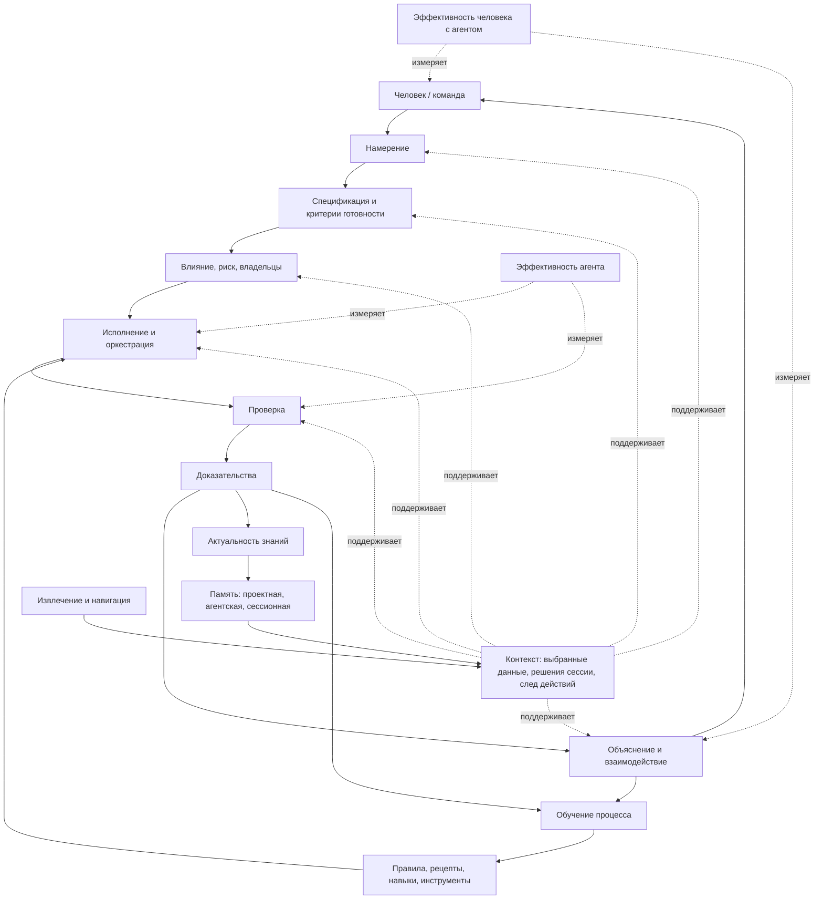

# Глоссарий и смысловая карта AI-кодинга

> Рабочий артефакт для презентации и обсуждения с IT-лидерами. Цель файла — зафиксировать общий язык: какие фундаментальные задачи возникают в AI-кодинге независимо от конкретного агента, IDE, framework или внутренней методологии.

---

## 1. Зачем нужен общий словарь

В AI PDLC появляется много инструментов и фреймворков: GigaCode, Codex, Claude Code, Cursor, OpenSpec, Superpowers, GSD, GStack, CodeIndexer, DeepWiki, внутренние агенты и расширения IDE.

Команды часто начинают с выбора инструмента или придумывают собственный процесс под себя. Это нормально, но фундаментальные задачи остаются одними и теми же:

- понять намерение человека;
- собрать релевантный контекст;
- не перепутать контекст с истиной;
- превратить запрос в спецификацию;
- оценить влияние и риск;
- управлять исполнением агента;
- проверить результат;
- предъявить доказательства;
- обновить знания проекта;
- объяснить человеку, что произошло;
- измерить эффективность агента и связки человек-агент.

Без общей карты сложно улучшать процесс: каждая команда оптимизирует отдельный инструмент, но не видит, какую часть общей системы она на самом деле улучшает.

Короткий тезис:

```text
Фреймворки можно менять.
Фундаментальные задачи AI-кодинга остаются.
```

---

## 2. Смысловая диаграмма

Диаграмма не показывает каждый термин. Она показывает крупные зоны ответственности и основные связи.



Главная идея:

```text
Контекст — сквозная рабочая плоскость.
Спецификация, исполнение и проверка — управляемый цикл изменения.
Объяснение связывает агента с человеком.
Эффективность нужно измерять и у агента, и у человека с агентом.
```

---

## 3. Общая смысловая таблица компонентов

| Компонент | Смысл | Что входит | Типовые артефакты | Что можно улучшать |
|---|---|---|---|---|
| Управление контекстом | Собрать правильный рабочий набор данных и решений | код, документы, правила, логи, тесты, решения сессии, след действий | context pack, карта источников, summary, ссылки | извлечение, навигация, сжатие, актуальность, токен-бюджет |
| Память и знания | Хранить долговременные и временные знания разного уровня авторитетности | память проекта, память агента, сессионная память | ADR, спецификации, правила, skills, session notes | authority stack, lifecycle, promotion в проектные знания |
| Намерение | Понять, зачем человек просит изменение | цель, проблема, ограничения, ожидания, non-goals | intent note, уточнения | качество вопросов, scope control |
| Спецификация | Зафиксировать, что именно должно измениться | ожидаемое поведение, ограничения, критерии готовности | OpenSpec, change spec, acceptance criteria | шаблоны, детализация, проверяемость |
| Влияние и риск | Понять, что затронет изменение и сколько контроля нужно | модули, владельцы, контракты, безопасность, миграции | impact report, risk level | code ownership, dependency maps, risk-based gates |
| Исполнение и оркестрация | Управлять тем, как агент выполняет работу | фазы, роли, режимы, команды, разрешения, отклонения | plan, run log, diff, audit trail | phases, approvals, runtime boundaries, recipes |
| Проверка | Доказать, что результат соответствует критериям | тесты, review, contract checks, security checks, smoke | test output, CI report, verification note | test strategy, coverage, quality gates |
| Доказательства | Сделать результат проверяемым для человека и команды | выводы команд, ссылки, diff, принятые решения | evidence report, handoff summary | inspectability, traceability, audit |
| Актуальность знаний | Контролировать рассинхрон между кодом, docs, specs и памятью | устаревшие документы, изменившиеся контракты, freshness findings | freshness report, doc update | drift control, ownership, freshness checks |
| Объяснение и взаимодействие | Держать человека в control loop | вопросы, статусы, объяснение плана, rationale, итог | status update, question, final explanation, handoff | качество коммуникации, своевременность эскалаций |
| Обучение процесса | Улучшать правила и инструменты на основе evidence | insights, recurring failures, proposals, evals | improvement proposal, new recipe, skill update | GigaCode /insights, AI Engineer Coach, evals |
| Эффективность агента | Понять, насколько хорошо агент выполняет работу | скорость, точность, переделки, токены, качество evidence | metrics, traces, insights | context economy, first-pass correctness, verification quality |
| Эффективность человека с агентом | Понять, усиливает ли агент инженера или только добавляет overhead | постановка задач, контроль, review, принятие решений, когнитивная нагрузка | productivity notes, survey, lead time, review effort | UX агента, explainability, шаблоны задач, coaching |

---

## 4. Глоссарий терминов

### Контекст

**Определение:** рабочая проекция задачи: выбранные данные, решения текущей сессии и след уже выполненных действий, которые агент использует для понимания, исполнения, проверки и объяснения работы.

```text
Контекст = выбранные данные + решения сессии + след действий.
```

**Чем не является:** контекст не равен всей истине проекта и не является одним универсальным хранилищем.

**Примеры:** фрагменты кода, тесты, `AGENTS.md`, спецификация, вывод команды, решение “не трогаем публичный API”, summary предыдущей сессии.

**Зачем нужен:** без контекста агент действует вслепую; с плохим контекстом агент уверенно делает неправильные изменения.

**Типичные ошибки:** загрузить слишком много, загрузить устаревшее, не указать авторитетность, смешать факт с предположением агента.

### Контекст в широком смысле

**Определение:** вся информационная среда, из которой агент может брать опору.

**Примеры:** кодовая база, тесты, архитектура, бизнес-требования, Confluence через `MCP`, логи, skills, память агента, правила репозитория, история прошлых действий.

**Зачем нужен:** показывает, что “контекст” шире, чем набор файлов в окне модели.

### Контекст в узком смысле

**Определение:** то, что реально попало в рабочую область агента прямо сейчас: контекстное окно, context pack, активный план, handoff summary, текущие решения сессии.

**Чем не является:** не полная картина проекта и не гарантия истины.

**Зачем нужен:** именно узкий контекст влияет на следующее действие агента.

### Контекстное окно

**Определение:** ограниченный объём информации, который модель может учитывать в текущем вызове.

**Примеры:** пользовательский запрос, инструкции, фрагменты файлов, результаты команд, краткие summaries.

**Зачем нужен:** это рабочая память модели в момент принятия решения.

**Типичные ошибки:** перегрузить окно шумом, держать старые решения, забыть актуальные constraints, вставить длинный документ вместо короткого проверяемого summary.

### Извлечение контекста

**Определение:** поиск, сбор и первичная фильтрация источников, которые могут быть полезны для задачи.

**Примеры:** `rg`, индексный поиск, CodeIndexer, DeepWiki, `MCP` к Confluence, чтение тестов, получение логов.

**Зачем нужно:** агент должен найти нужную информацию до того, как начнёт менять систему.

**Типичные ошибки:** сразу писать код, искать только по названию файла, не проверять внешние источники, не отличать найденное от авторитетного.

### Навигация по контексту

**Определение:** движение между уровнями детализации: от карты проекта к конкретным файлам, функциям, тестам, контрактам и доказательствам.

**Пример маршрута:**

```text
карта проекта
→ релевантные модули
→ конкретные файлы
→ функции
→ тесты
→ контракты
→ документы
→ evidence
```

**Зачем нужна:** позволяет не тащить весь проект в окно, а работать через управляемые срезы.

### Память

**Определение:** знания, которые сохраняются дольше одного действия агента и могут использоваться для будущих задач.

**Чем не является:** память не всегда является истиной. Память должна иметь источник, срок жизни, владельца и правила обновления.

### Память агента

**Определение:** знания и навыки, связанные с самим агентом: как он работает, какие процедуры знает, какие предпочтения пользователя или команды учитывает.

**Примеры:** skills, правила коммуникации, предпочтение “сначала план, потом код”, прошлые пользовательские инструкции.

**Риск:** агентская память может быть полезной, но не должна скрыто переписывать правила проекта.

### Память проекта

**Определение:** долговременное знание о проекте, которое команда считает устойчивым и авторитетным.

**Примеры:** код, спецификации, API-контракты, ADR, архитектурные документы, бизнес-правила, политики, reviewed docs.

**Зачем нужна:** позволяет агенту работать не только с текущим diff, но и с обещаниями проекта.

### Сессионная память

**Определение:** временное состояние текущей работы: что было решено, что проверено, какие допущения приняты, какие действия выполнены.

**Примеры:** активный план, уточнения пользователя, run log, список изменённых файлов, вывод тестов, отклонённые варианты.

**Правило:** сессионная память может стать памятью проекта только после проверки и явного закрепления.

### Намерение

**Определение:** зачем человек просит изменение и какую проблему хочет решить.

**Примеры:** “нужно ограничить доступ к API”, “нужно ускорить отчёт”, “нужно убрать ручной шаг из процесса”.

**Чем не является:** намерение не равно задаче в трекере и не равно конкретному техническому решению.

**Типичные ошибки:** агент принимает формулировку запроса за готовое решение и сразу пишет код.

### Спецификация

**Определение:** проверяемое описание того, что именно должно измениться.

**Что включает:** expected behavior, ограничения, non-goals, affected surfaces, критерии готовности.

**Примеры:** OpenSpec change, change spec, acceptance criteria, контракт API, миграционный сценарий.

**Зачем нужна:** превращает намерение в управляемую инженерную задачу.

### Критерии готовности

**Определение:** условия, по которым человек и агент понимают, что задача завершена.

**Примеры:** тесты проходят, контракт не сломан, документация обновлена, performance не деградировал, security check пройден.

```text
Намерение = зачем.
Спецификация = что должно быть.
Критерии готовности = как проверим.
```

### Влияние

**Определение:** область системы, которую может затронуть изменение.

**Примеры:** модули, API, схемы данных, UI, тесты, документация, downstream-сервисы, владельцы.

**Зачем нужно:** позволяет понять, где искать контекст и какие проверки нужны.

### Риск

**Определение:** вероятность и цена ошибки при изменении.

**Примеры:** безопасность, деньги, персональные данные, публичный API, миграции, production incident risk.

**Зачем нужен:** объём контроля должен зависеть от риска, а не быть одинаковым для всех задач.

### Исполнение

**Определение:** действия агента по выполнению задачи: чтение, изменение, запуск команд, создание артефактов, проверка гипотез.

**Чем не является:** исполнение не равно проверке. То, что агент сделал изменение, не доказывает его корректность.

### Оркестрация

**Определение:** управление порядком, режимом и границами исполнения.

**Что включает:** фазы, роли, runtime boundaries, permissions, approvals, logs, audit trail, deviations.

**Примеры:** “сначала impact, потом patch”, “без approval не менять миграции”, “после изменения API запустить contract tests”.

### Проверка

**Определение:** процесс подтверждения, что результат соответствует спецификации и не ломает важные свойства системы.

**Примеры:** unit tests, integration tests, contract checks, smoke, static analysis, review, security checks.

**Типичная ошибка:** считать, что отсутствие ошибки в одном запуске равно полной проверке.

### Доказательства

**Определение:** inspectable evidence, по которому человек или команда могут понять, что именно проверялось и какой был результат.

**Примеры:** вывод тестов, CI ссылка, diff, список команд, verification note, review comments.

**Зачем нужны:** без evidence результат агента нельзя надёжно принять или передать.

### Актуальность знаний

**Определение:** соответствие памяти, документации, спецификаций и контекстных summaries текущему состоянию системы.

**Примеры:** код изменился, но OpenAPI не обновился; ADR устарел; DeepWiki показывает старую карту; Confluence не отражает новый процесс.

**Зачем нужна:** AI-кодинг быстро порождает рассинхрон между кодом и знаниями, если не управлять freshness.

### Объяснение

**Определение:** способность агента понятно показать человеку, что он понял, что делает, почему выбрал такой путь, где есть риск и чем подтверждён результат.

**Что включает:** уточняющие вопросы, объяснение плана, статусы, rationale, trade-offs, объяснение diff, итоговое summary, handoff.

**Чем не является:** объяснение не является декоративным текстом в конце. Это часть управления агентом человеком.

### Взаимодействие с человеком

**Определение:** двусторонний control loop между человеком и агентом.

**Примеры:** агент просит уточнение, предлагает scope, сообщает о риске, ждёт approval, объясняет проверку, передаёт итог.

**Зачем нужно:** человек остаётся владельцем намерения, риска и принятия результата.

### Эффективность агента

**Определение:** насколько хорошо агент превращает намерение в корректное, проверенное и объяснимое изменение при разумной цене контроля.

**Что измерять:**

- точность понимания намерения;
- качество собранного контекста;
- компактность контекстного окна;
- количество лишних действий;
- first-pass correctness;
- количество переделок;
- качество проверки;
- полнота evidence;
- качество объяснений;
- стоимость в токенах, времени и командах.

**Примеры улучшений:** better context packs, GigaCode /insights, evals, run logs, более строгие recipes.

### Эффективность человека с агентом

**Определение:** насколько человек быстрее, точнее и спокойнее доводит engineering-задачу до результата, используя агента как инструмент анализа, исполнения, проверки и объяснения.

**Чем отличается от эффективности агента:** это метрика не агента самого по себе, а связки “человек использует агента”.

**Что измерять:**

- скорость перехода от идеи к проверенному изменению;
- снижение ручной рутины;
- качество постановки задачи;
- качество контроля scope;
- время на объяснение задачи агенту;
- время на review результата;
- количество переделок;
- понятность результата;
- обоснованное доверие к результату;
- снижение когнитивной нагрузки;
- помощь в принятии инженерных решений.

**Примеры улучшений:** explainability, шаблоны постановки задач, IDE coaching, VS Code extension AI Engineer Coach, нормальные handoff summaries.

### Эффективность системы человек-агент

**Определение:** насколько вся связка “человек + агент + процесс + инструменты” даёт качественный, проверяемый и управляемый результат.

**Формула:**

```text
Эффективность системы человек-агент =
качество результата
+ скорость
+ управляемость
+ проверяемость
+ понятность
- стоимость контроля
- количество переделок
- когнитивная нагрузка.
```

**Зачем нужна:** для IT-лидеров важна не демонстрация генерации кода, а улучшение engineering throughput без потери контроля.

### Framework / фреймворк

**Определение:** набор правил, артефактов, workflow и инструментов, который помогает управлять AI-кодингом.

**Примеры:** OpenSpec для спецификаций, Superpowers для disciplined workflows, GSD/GStack для process scaffolding, внутренние agent frameworks.

**Чем не является:** фреймворк не должен подменять фундаментальную модель. Он закрывает часть компонентов модели.

### Adapter / адаптер

**Определение:** конкретный инструмент или интеграция, которая реализует часть общей модели.

**Примеры:** GigaCode как coding agent, CodeIndexer как навигация по коду, DeepWiki как карта знаний, `MCP` как доступ к внешним источникам, CI как evidence provider.

**Зачем нужен:** позволяет менять инструменты, не теряя понятийную модель процесса.

---

## 5. Как читать инструменты через эту модель

| Инструмент / подход | Какую часть модели усиливает | Что не закрывает полностью |
|---|---|---|
| GigaCode | исполнение, объяснение, работа с кодом, insights | не заменяет проектную память и governance |
| CodeIndexer | извлечение и навигация по кодовому контексту | не решает намерение, risk gates и проверку |
| DeepWiki | карта проекта и knowledge navigation | требует проверки актуальности и авторитетности |
| OpenSpec | спецификация, критерии готовности, change lifecycle | не исполняет код и не доказывает качество сам по себе |
| Superpowers | disciplined workflow, planning, verification habits | требует адаптации к repo policies |
| GSD / GStack | процесс, decomposition, orchestration | не является универсальной истиной проекта |
| `MCP` | доступ к внешним источникам | не гарантирует авторитетность и актуальность данных |
| GigaCode /insights | обучение процесса, recurring patterns, performance | требует review перед изменением правил |
| VS Code extension AI Engineer Coach | эффективность человека с агентом, coaching, feedback | не заменяет evidence и engineering gates |

Вывод:

```text
Инструменты — это адаптеры.
Стабильная часть — контрольная модель:
контекст, память, намерение, спецификация, исполнение,
проверка, доказательства, актуальность, объяснение и эффективность.
```

---

## 6. Минимальный набор вопросов для команды

Эти вопросы помогают быстро понять, где в AI-кодинге уже есть контроль, а где процесс держится на случайности.

| Вопрос | Какой компонент проверяет |
|---|---|
| Как агент понимает намерение человека? | намерение |
| Где фиксируется, что именно должно измениться? | спецификация |
| Как агент выбирает контекст и не перегружает окно? | управление контекстом |
| Какие источники считаются авторитетными? | память и знания |
| Как агент понимает влияние и риск? | impact / risk |
| Когда агент может сразу писать код, а когда нужен план или approval? | оркестрация |
| Чем доказывается, что задача выполнена? | проверка и evidence |
| Что происходит, если код изменился, а документы устарели? | актуальность знаний |
| Как агент объясняет человеку свои решения? | объяснение |
| Как мы понимаем, что агент стал эффективнее? | эффективность агента |
| Как мы понимаем, что человеку стало проще и быстрее работать? | эффективность человека с агентом |

---

## 7. Термины-кандидаты из `AI_DISRUPT_PDLC_v3.pdf`

Эти термины полезны как внешний профессиональный словарь. Их не обязательно все выносить на диаграмму, но они помогают связать нашу модель с уже существующей терминологией AI PDLC.

| Термин | Короткое определение | Как использовать в нашей модели |
|---|---|---|
| `Intent Loop` | Человеческая петля формирования намерения, альтернатив, решений и спецификации | объяснять, где человек остаётся владельцем смысла и риска |
| `Implementation Loop` | Агентная петля реализации, тестов, проверок и подготовки результата | объяснять, где агент исполняет управляемую работу |
| `Specification-Driven Development` / `SDD` | Подход, где спецификация становится управляющим артефактом для человека и агента | усиливает блок “намерение → спецификация → критерии готовности” |
| `Context Engineering` | Дисциплина отбора, структурирования, сжатия и подачи контекста агенту | профессиональное название управления контекстом |
| `Context-Driven Engineering` | Организация разработки вокруг machine-readable контекста | стратегический термин для IT-лидеров |
| `Context rot` | Деградация качества контекстного окна из-за шума, устаревания и перегруза | проблема перегруженного и протухшего контекста |
| `Context poisoning` | Попадание ошибки или галлюцинации в persistent context с повторным использованием | риск памяти и context lifecycle |
| `Just-in-time context` | Подгрузка нужного контекста в момент необходимости | практика навигации и экономии токенов |
| `Context compaction` | Сжатие контекста с сохранением решений, фактов и открытых вопросов | практика управления контекстным окном |
| `Token budget` | Ограничение токенов как операционный ресурс задачи | метрика эффективности агента |
| `Token Economics` / `TokenOps` | Управление стоимостью AI-исполнения | enterprise-метрики и platform layer |
| `Eval-driven development` | Улучшение агента, промптов и workflow через систематические оценки | мост между проверкой, learning и performance |
| `Capability eval` | Оценка того, что агент способен делать | измерение прогресса агента |
| `Regression eval` | Проверка, что новое изменение не ухудшило уже достигнутое | quality gate для агента и процесса |
| `LLM-as-judge` | Использование модели как оценщика там, где сложно формализовать проверку | осторожно применять для семантических проверок |
| `Specification Compliance Rate` | Доля требований спецификации, корректно реализованных с первого раза | метрика качества спецификации и агента |
| `Human Intervention Rate` | Доля задач, где потребовалось ручное вмешательство | метрика автономности и эффективности системы человек-агент |
| `Session Handoff Protocol` | Стандарт передачи состояния между агентными сессиями | сессионная память, trace, handoff |
| `Feature Registry` | Реестр атомарных задач/фич для долгих агентных задач | декомпозиция и контроль прогресса |
| `Quality Gate` | Обязательная проверка перед продвижением изменения | verification / governance |
| `Golden Path` | Рекомендуемый end-to-end маршрут задачи через платформу | policies, recipes, tooling |
| `Paved Roads` | Стандартные маршруты и шаблоны, удобные по умолчанию | adoption и снижение cognitive load |
| `IDP` | Integrated Development Platform как enterprise-поверхность управления агентами | реализация control model на уровне организации |
| `Agent Runtime` | Среда выполнения агентных задач | runtime boundaries, sandbox, monitoring |
| `Model Gateway` | Единая точка доступа к моделям с контролем стоимости и аудита | portability, governance, TokenOps |
| `Specification Registry` | Версионированное хранилище спецификаций | память проекта и traceability |
| `Eval Registry` | Реестр eval-задач, грейдеров и метрик | learning loop и regression protection |
| `Context Sanitizer` | Очистка контекста от секретов, PII и unsafe data | security control для контекста |
| `Audit Logger` | Фиксация запросов, контекста, ответов и действий агента | evidence, audit trail, compliance |
| `Policy Engine` | Машинно-исполняемые политики для workflow агента | governance без ручной дисциплины |

Рабочая интерпретация:

```text
Две петли объясняют, где работает человек и где работает агент.
Наша компонентная модель объясняет, чем нужно управлять внутри и между петлями.
IDP, Golden Path и Governance — способы enterprise-реализации этой модели.
```

---

## 8. Финальная формула для презентации

```text
Цель AI-кодинга — не просто ускорить генерацию кода.

Цель — повысить эффективность управляемой инженерной системы:
человек лучше формулирует и контролирует задачу,
агент лучше исполняет и объясняет работу,
а результат лучше проверяется, документируется и поддерживается.
```
